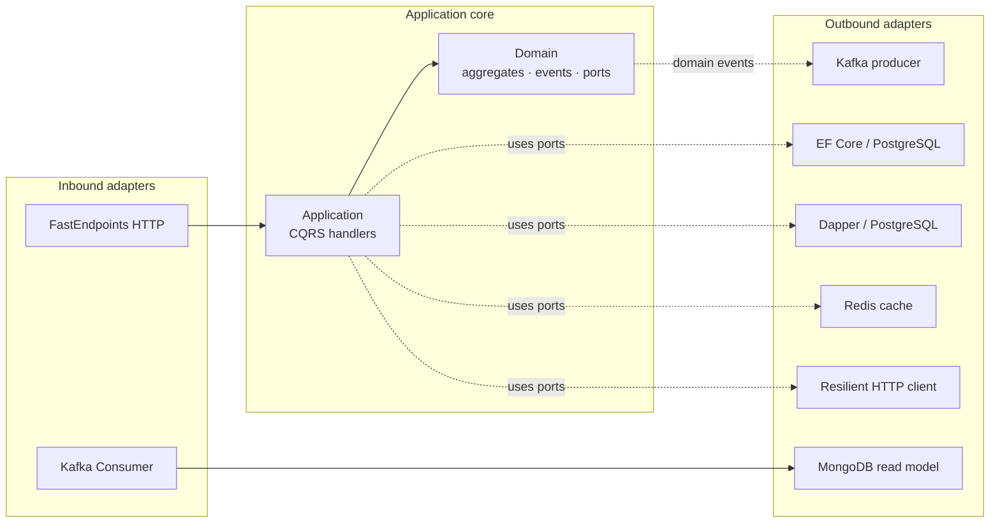

# Hex.Scaffold

A production-grade **.NET 10 hexagonal (ports & adapters) microservice scaffold**. It demonstrates a canonical architecture for a cloud-native service with CQRS, domain events, strongly-typed IDs, and pluggable persistence, messaging, and HTTP adapters.

This template is intended as a starting point for Azure AKS / Kubernetes workloads but nothing outside the composition root is cloud-specific.

---

## Highlights

- **Hexagonal architecture** with architecture tests enforcing layer boundaries (NetArchTest).
- **CQRS via Mediator** (source generator) — no reflection, no runtime handler scanning.
- **Domain events** dispatched through EF Core `SaveChangesInterceptor`, bridged to Kafka via `INotificationHandler`.
- **Strongly-typed value objects** with [Vogen](https://github.com/SteveDunn/Vogen) for IDs and primitives.
- **Result pattern** for explicit outcome handling; no exceptions for expected flows.
- **FastEndpoints** API (not controllers) with FluentValidation, OpenAPI, and Scalar UI.
- **Polyglot persistence** out of the box: PostgreSQL (writes), Dapper (reads), MongoDB (denormalised read models), Redis (cache).
- **Kafka** producer and consumer (BackgroundService).
- **Resilient HTTP client** via `Microsoft.Extensions.Http.Resilience`.
- **Full observability** — OpenTelemetry traces, metrics, logs (OTLP) + Serilog.
- **Health checks** at `/healthz` (liveness) and `/ready` (readiness).
- **Rate limiting** (per-IP fixed window).
- **Three test tiers**: unit (xUnit + NSubstitute + Shouldly), integration (Testcontainers), architecture (NetArchTest).

---

## Quick Start

```bash
# build everything
dotnet build

# run the API (listens on :8080)
dotnet run --project src/Hex.Scaffold.Api

# run all tests
dotnet test

# run only architecture tests (fast, no Docker)
dotnet test --filter "Category=Architecture"
```

Integration tests require Docker (Testcontainers spin up PostgreSQL and Redis automatically).

### Deploying to Kubernetes

A production-shaped Helm chart lives at [`deploy/helm/hex-scaffold`](deploy/helm/hex-scaffold) — see its [chart README](deploy/helm/hex-scaffold/README.md) for the complete parameter reference (every `values.yaml` knob, type, default, allowed values), and [`docs/deployment.md`](docs/deployment.md) for install-flow guidance. A single ConfigMap is the source of truth for which adapters are wired at runtime.

```bash
helm upgrade --install hex-scaffold ./deploy/helm/hex-scaffold \
  --set features.inbound=rest --set features.outbound=kafka \
  --set features.persistence=postgres --set features.redis=true \
  --set secrets.appInsightsConnectionString="$APP_INSIGHTS_CS"
```

By default the chart also renders an in-cluster **WireMock** Deployment + Service that the outbound HTTP adapter calls (with a 300ms baked-in delay), and ships a self-contained EF Core migration bundle (`/app/efbundle`) inside the runtime image so the Helm pre-install/pre-upgrade hook runs migrations without needing the .NET SDK at runtime.

### Load testing

- **REST**: k6 script + k6-Operator `TestRun` at [`tests/loadtest/k6/`](tests/loadtest/k6/)
- **Kafka**: kafka-cli driver + committed event deck at [`tests/loadtest/kafka/`](tests/loadtest/kafka/)

Both flows are documented end-to-end, including the Azure Monitor KQL for the four golden signals, in [`docs/loadtest.md`](docs/loadtest.md).

Once the API is running:

- Scalar UI: `http://localhost:8080/scalar/v1`
- Swagger JSON: `http://localhost:8080/swagger/v1/swagger.json`
- Liveness: `http://localhost:8080/healthz`
- Readiness: `http://localhost:8080/ready`

### EF Core migrations

```bash
dotnet ef migrations add <Name> \
  --project src/Hex.Scaffold.Adapters.Persistence \
  --startup-project src/Hex.Scaffold.Api
```

---

## Architecture at a glance



Dependency rule (enforced by [`HexagonalDependencyTests`](tests/Hex.Scaffold.Tests.Architecture/HexagonalDependencyTests.cs)):

```
Domain  ←  Application  ←  Adapters.*  ←  Api (composition root)
```

See [`docs/architecture.md`](docs/architecture.md) for the full breakdown.

---

## Documentation

| Doc | What's in it |
|---|---|
| [`docs/architecture.md`](docs/architecture.md) | Hexagonal structure, dependency flow, project map, architecture tests |
| [`docs/domain.md`](docs/domain.md) | Aggregates, value objects, domain events, Result pattern, specifications, SmartEnum |
| [`docs/application.md`](docs/application.md) | CQRS use cases, Mediator pipeline, logging behavior, ports |
| [`docs/adapters.md`](docs/adapters.md) | Inbound (HTTP, Kafka consumer) and outbound (EF, Dapper, Mongo, Redis, Kafka, HTTP) adapters |
| [`docs/api.md`](docs/api.md) | HTTP endpoints, request/response schemas, error mapping |
| [`docs/events.md`](docs/events.md) | Domain event dispatch, Kafka publish, read-model projection flow |
| [`docs/observability.md`](docs/observability.md) | OpenTelemetry, Azure Application Insights, four golden signals, Serilog, health, rate limit |
| [`docs/deployment.md`](docs/deployment.md) | Helm chart & the ConfigMap-driven adapter selector |
| [`docs/database.md`](docs/database.md) | PostgreSQL schema, EF Core migration strategy — `/app/efbundle` shipped in the runtime image, Helm pre-install/pre-upgrade hook, design-time factory |
| [`docs/loadtest.md`](docs/loadtest.md) | End-to-end load testing — k6 for REST, Strimzi + kafka-cli for Kafka |
| [`docs/testing.md`](docs/testing.md) | Unit, integration, architecture test strategy |
| [`docs/development.md`](docs/development.md) | Local infra (Docker), configuration, EF migrations, troubleshooting |

---

## Solution layout

```
src/
  Hex.Scaffold.Domain/                 # Aggregates, value objects, domain events, ports (interfaces)
  Hex.Scaffold.Application/            # CQRS commands/queries/handlers, DTOs, pipeline behaviors
  Hex.Scaffold.Adapters.Inbound/       # FastEndpoints HTTP + Kafka BackgroundService consumer
  Hex.Scaffold.Adapters.Outbound/      # Kafka producer, resilient HTTP client
  Hex.Scaffold.Adapters.Persistence/   # EF Core (Postgres), Dapper queries, MongoDB, Redis
  Hex.Scaffold.Api/                    # Composition root — DI, OTel, middleware, health, rate limiting
tests/
  Hex.Scaffold.Tests.Architecture/     # NetArchTest — enforces dependency rules
  Hex.Scaffold.Tests.Unit/             # xUnit + NSubstitute + Shouldly
  Hex.Scaffold.Tests.Integration/      # Testcontainers (PostgreSQL, Redis) + WebApplicationFactory
```

---

## Tech stack

.NET 10 · C# latest · FastEndpoints · Mediator (source generator) · Vogen · EF Core 10 (Npgsql) · Dapper · MongoDB.Driver · StackExchange.Redis · Confluent.Kafka · Microsoft.Extensions.Http.Resilience · OpenTelemetry · Serilog · FluentValidation · Scrutor · NetArchTest · xUnit · Shouldly · NSubstitute · Testcontainers.

Package versions are managed centrally in [`Directory.Packages.props`](Directory.Packages.props).

---

## License

See repository metadata.
