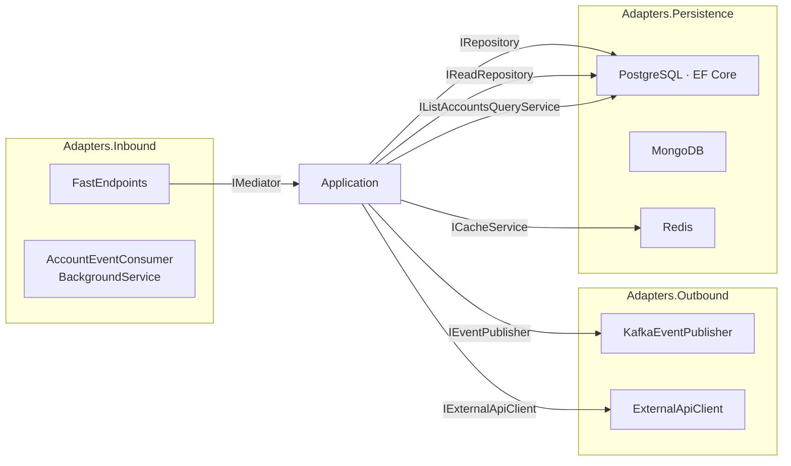

# Adapters

Adapters implement the ports declared in the core. The scaffold ships three adapter projects: **Inbound**, **Outbound**, and **Persistence**.



---

## Inbound adapters

### FastEndpoints HTTP

[`Adapters.Inbound/Api/Accounts/`](../src/Hex.Scaffold.Adapters.Inbound/Api/Accounts)

Every endpoint is a class that extends `Endpoint<TRequest, TResult>`. The pattern:

1. `Configure()` sets verb + route + tags + summary.
2. `ExecuteAsync()` builds a command/query, calls `IMediator.Send`, and returns `TypedResults` (or maps the `Result` via `ResultExtensions`).

The wire format is **snake_case end-to-end** — `MiddlewareConfig` configures the FastEndpoints serializer with `JsonNamingPolicy.SnakeCaseLower` so PascalCase property names on `AccountDto` / `Create/UpdateAccountRequest` map onto `applied_configurations`, `contact_email`, etc. without `[JsonPropertyName]` decoration.

Example — `CreateAccount`:

```csharp
public override async Task<Results<Ok<AccountDto>, ProblemHttpResult>>
  ExecuteAsync(CreateAccountRequest request, CancellationToken ct)
{
  var command = new CreateAccountCommand(
    Livemode: request.Livemode ?? false,
    DisplayName: request.DisplayName,
    ContactEmail: request.ContactEmail,
    ContactPhone: request.ContactPhone,
    AppliedConfigurations: AccountFieldHelpers.ToAppliedConfigs(request.AppliedConfigurations),
    ConfigurationJson: SerializeOrNull(request.Configuration),
    IdentityJson:      SerializeOrNull(request.Identity),
    DefaultsJson:      SerializeOrNull(request.Defaults),
    MetadataJson:      SerializeOrNull(request.Metadata));

  var result = await mediator.Send(command, ct);
  if (result.IsSuccess) return TypedResults.Ok(result.Value);
  return TypedResults.Problem(result.Errors.FirstOrDefault() ?? "An error occurred.");
}
```

Validation is done with `Validator<T> : AbstractValidator<T>` (FluentValidation) — FastEndpoints integrates these automatically and returns `ValidationProblem` before the handler runs.

`UpdateAccount` uses **`JsonElement`-typed fields** to express Stripe's omitted-vs-explicit-null partial-update semantics. `AccountFieldHelpers.ToMaybeString` / `ToMaybeRawJson` / `ToMaybeAppliedConfigs` collapse a `JsonElement` into the `(HasValue, Value?)` tuples the aggregate's `ApplyUpdate` accepts.

`ResultExtensions` ([`Api/Extensions/ResultExtensions.cs`](../src/Hex.Scaffold.Adapters.Inbound/Api/Extensions/ResultExtensions.cs)) maps `Result.Status` to HTTP responses:

| Result.Status | HTTP |
|---|---|
| `Ok` | `200 OK` (Stripe-faithful — never returns 201) |
| `NotFound` | `404 NotFound` |
| `Invalid` | `400 ValidationProblem` |
| `Error` | `500 Problem` |

### Kafka consumer

[`Messaging/AccountEventConsumer.cs`](../src/Hex.Scaffold.Adapters.Inbound/Messaging/AccountEventConsumer.cs) is a `BackgroundService` registered only when `features.inbound=kafka` (the cluster runs `inbound=rest`, so this never starts in production). It:

1. Subscribes to the `v2.core.accounts` topic.
2. Reads messages on a long-running task.
3. Extracts the W3C trace context propagated by `KafkaEventPublisher` so producer→consumer edges still render in App Map (PR #17 plumbing).
4. Logs the event by type and commits offsets after successful processing (`EnableAutoCommit = false`).

This consumer is intentionally minimal — it does not project to a Mongo read model. The earlier `SampleReadModelRepository` / `SampleEventConsumer` pair was retired alongside the Sample aggregate; an `AccountReadModelRepository` can drop in here without changing the consumer's structure.

---

## Outbound adapters

### Kafka producer

[`Messaging/KafkaEventPublisher.cs`](../src/Hex.Scaffold.Adapters.Outbound/Messaging/KafkaEventPublisher.cs) implements `IEventPublisher`:

- Serialises the event with `System.Text.Json`.
- Uses `typeof(TEvent).Name` as the message **key** so consumers can switch on event type (`AccountCreatedEvent`, `AccountUpdatedEvent`).
- Manually injects W3C trace context (`traceparent` / `tracestate`) into Kafka headers so the consumer can link its activity to the producer's.
- Swallows `ProduceException` and logs — this is **fire-and-forget / eventual consistency**. Add the Transactional Outbox pattern before production.

When `features.outbound=rest`, `NoOpEventPublisher` ([`Adapters.Outbound/Messaging/NoOpEventPublisher.cs`](../src/Hex.Scaffold.Adapters.Outbound/Messaging/NoOpEventPublisher.cs)) takes the slot — logs at Debug, drops the event. Required so domain handlers can inject `IEventPublisher` unconditionally without DI exploding when no Kafka producer is registered.

Producer config (in `ServiceConfigs.cs`):

```csharp
Acks = Acks.All
EnableIdempotence = true
```

### Resilient HTTP client

[`Http/ExternalApiClient.cs`](../src/Hex.Scaffold.Adapters.Outbound/Http/ExternalApiClient.cs) implements `IExternalApiClient` over a named `HttpClient` registered with `AddStandardResilienceHandler()` from `Microsoft.Extensions.Http.Resilience` (retries, circuit breaker, timeout, rate limiter — per Microsoft defaults).

Response mapping:

| Upstream status | Result |
|---|---|
| `404` | `Result.NotFound()` |
| `2xx` | `Result.Success(T)` |
| anything else | `Result.Error(...)` |
| `HttpRequestException` | `Result.Error(...)` |

Base URL is read from `ExternalApi:BaseUrl`. In Helm renders, the chart helper `hex-scaffold.externalApiBaseUrl` resolves this:

- `wiremock.enabled=true` (default) → `http://<release>-wiremock:8080`. The HTTP adapter then talks to an in-cluster WireMock with a baked-in 300ms response delay (`wiremock.fixedDelayMs`), useful for exercising the resilience pipeline deterministically.
- `wiremock.enabled=false` → falls back to `secrets.externalApiBaseUrl` (default `https://httpbin.org`).

See [`deploy/helm/hex-scaffold/README.md#wiremock-parameters`](../deploy/helm/hex-scaffold/README.md#wiremock-parameters) for stub authoring.

---

## Persistence adapters

### PostgreSQL + EF Core (writes)

- `AppDbContext` exposes `DbSet<Account>`. Entity configurations are discovered from the assembly.
- [`AccountConfiguration`](../src/Hex.Scaffold.Adapters.Persistence/PostgreSql/Config/AccountConfiguration.cs) maps the aggregate. snake_case column names; `AccountId` value object → `varchar(64)` via `HasConversion`; `AppliedConfigurations` → native Postgres `text[]`; nested-blob columns → `jsonb`.
- `RepositoryBase<T>` provides the generic CRUD + spec-based read. `EfRepository<T>` is a thin seal.
- `EventDispatcherInterceptor` is an EF `SaveChangesInterceptor`. After a successful commit it collects every `HasDomainEventsBase` entry from the ChangeTracker and delegates to `IDomainEventDispatcher`.
- `MediatorDomainEventDispatcher` implements `IDomainEventDispatcher` by publishing each event through `IMediator`. See [`events.md`](events.md).

`PostgreSqlServiceExtensions` builds an `NpgsqlDataSource` with **`EnableDynamicJson()`** — required for the `string` ↔ `jsonb` round-trip on the nested-blob columns. Without that flag Npgsql rejects raw strings against `jsonb` parameters. Retry-on-failure (5 attempts, 30s window, 60s command timeout) is configured on the same data source.

### Cursor-paginated reads

[`PostgreSql/Queries/ListAccountsQueryService.cs`](../src/Hex.Scaffold.Adapters.Persistence/PostgreSql/Queries/ListAccountsQueryService.cs) implements `IListAccountsQueryService`. Reads are EF (`AsNoTracking`) — Dapper isn't needed here because the read shape is identical to the aggregate. Pagination is keyset on `created` only:

- `starting_after` resolves the cursor row's `created` once, then filters `created < cursor`.
- `ending_before` filters `created > cursor`, fetches ascending, reverses to keep the page newest-first.
- One row is over-fetched (`limit + 1`) so `has_more` is computed without a second round-trip.

The `(created, id)` tiebreaker that would normally accompany keyset pagination was dropped because composite-key comparisons across a Vogen-typed PK don't translate cleanly to SQL. Demo-grade trade-off.

### MongoDB

Mongo currently has no read-model wired — the registration shape is preserved (`MongoDbServiceExtensions` registers `IMongoClient` for the `features.persistence=mongo` selector path), but no `IAccountReadModelRepository` exists. A future PR can add one without touching the registration.

### Redis cache

`RedisCacheService` implements `ICacheService` with `IConnectionMultiplexer` as a singleton. Get/Set/Remove all catch `RedisConnectionException` and degrade gracefully — a cache miss / skipped write never breaks the handler. JSON is used for values.

When `features.UseRedis=false`, `NullCacheService` ([`Adapters.Persistence/Common/NullCacheService.cs`](../src/Hex.Scaffold.Adapters.Persistence/Common/NullCacheService.cs)) takes the slot — `GetAsync` returns default, `Set/Remove` no-op. Same fallback rationale as `NoOpEventPublisher`.

### DI registration

Each store has its own extension method (`AddPostgreSqlServices`, `AddMongoDbServices`, `AddRedisServices`). [`Api/Configurations/ServiceConfigs.cs`](../src/Hex.Scaffold.Api/Configurations/ServiceConfigs.cs) calls them, then adds Kafka + HTTP, then runs **Scrutor** with `RegistrationStrategy.Skip` across the adapter assemblies. Scrutor picks up any type whose name ends in `Service`, `Repository`, `Publisher`, or `Client` and registers it under its implemented interfaces — explicit registrations win.

This is the "safety net" — when you add a new port/adapter pair, Scrutor may wire it automatically.
