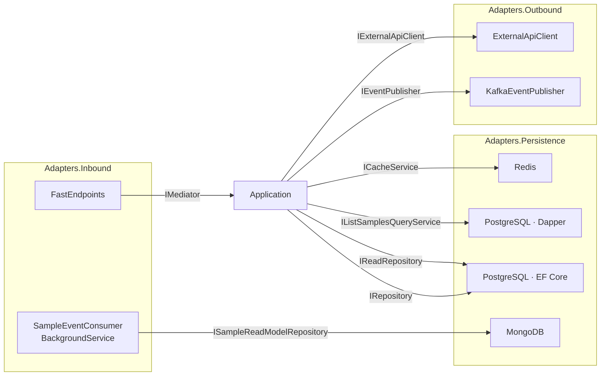

# Adapters

Adapters implement the ports declared in the core. The scaffold ships three adapter projects: **Inbound**, **Outbound**, and **Persistence**.



---

## Inbound adapters

### FastEndpoints HTTP

[`Adapters.Inbound/Api/Samples/`](../src/Hex.Scaffold.Adapters.Inbound/Api/Samples)

Every endpoint is a class that extends `Endpoint<TRequest, TResult>` (optionally with a `Mapper`). The pattern:

1. `Configure()` sets verb + route + tags + summary.
2. `ExecuteAsync()` builds a command/query, calls `IMediator.Send`, and maps the `Result` to `TypedResults` via `ResultExtensions`.

Example — `Create`:

```csharp
public override async Task<Results<Created<CreateSampleResponse>, ValidationProblem, ProblemHttpResult>>
  ExecuteAsync(CreateSampleRequest request, CancellationToken ct)
{
  var command = new CreateSampleCommand(SampleName.From(request.Name!), request.Description);
  var result = await mediator.Send(command, ct);

  return result.ToCreatedResult(
    id => $"/samples/{id.Value}",
    id => new CreateSampleResponse(id.Value, request.Name!));
}
```

Validation is done with `Validator<T> : AbstractValidator<T>` (FluentValidation) — FastEndpoints integrates these automatically and returns `ValidationProblem` before the handler runs.

`ResultExtensions` ([`Api/Extensions/ResultExtensions.cs`](../src/Hex.Scaffold.Adapters.Inbound/Api/Extensions/ResultExtensions.cs)) maps `Result.Status` to HTTP responses:

| Result.Status | HTTP |
|---|---|
| `Ok` | `200 Ok` / `201 Created` / `204 NoContent` |
| `NotFound` | `404 NotFound` |
| `Invalid` | `400 ValidationProblem` |
| `Error` | `500 Problem` |

### Kafka consumer

[`Messaging/SampleEventConsumer.cs`](../src/Hex.Scaffold.Adapters.Inbound/Messaging/SampleEventConsumer.cs) is a `BackgroundService` that:

1. Subscribes to the `sample-events` topic.
2. Reads messages on a long-running task.
3. Dispatches to the Mongo read-model repository based on the event key (`SampleCreatedEvent`, `SampleUpdatedEvent`, `SampleDeletedEvent`).
4. Manually commits offsets after successful processing (`EnableAutoCommit = false`).

Handles `ConsumeException`, `JsonException`, and `KeyNotFoundException` with logs. A `TODO` marks where a dead-letter topic would go.

---

## Outbound adapters

### Kafka producer

[`Messaging/KafkaEventPublisher.cs`](../src/Hex.Scaffold.Adapters.Outbound/Messaging/KafkaEventPublisher.cs) implements `IEventPublisher`:

- Serialises the event with `System.Text.Json`.
- Uses `typeof(TEvent).Name` as the message **key** so consumers can switch on event type.
- Swallows `ProduceException` and logs — this is **fire-and-forget / eventual consistency**. Add the Transactional Outbox pattern before production.

Producer config (in `ServiceConfigs.cs`):

```csharp
Acks = Acks.All
EnableIdempotence = true
```

### Resilient HTTP client

[`Http/ExternalApiClient.cs`](../src/Hex.Scaffold.Adapters.Outbound/Http/ExternalApiClient.cs) implements `IExternalApiClient` over a named `HttpClient` registered with `AddStandardResilienceHandler()` from `Microsoft.Extensions.Http.Resilience` (retries, circuit breaker, timeout, rate limiter — per Microsoft defaults).

Response mapping:

| Upstream status | Result |
|---|---|
| `404` | `Result.NotFound()` |
| `2xx` | `Result.Success(T)` |
| anything else | `Result.Error(...)` |
| `HttpRequestException` | `Result.Error(...)` |

Base URL is read from `ExternalApi:BaseUrl`. In Helm renders, the chart helper `hex-scaffold.externalApiBaseUrl` resolves this:

- `wiremock.enabled=true` (default) → `http://<release>-wiremock:8080`. The HTTP adapter then talks to an in-cluster WireMock with a baked-in 300ms response delay (`wiremock.fixedDelayMs`), useful for exercising the resilience pipeline deterministically.
- `wiremock.enabled=false` → falls back to `secrets.externalApiBaseUrl` (default `https://httpbin.org`).

See [`deploy/helm/hex-scaffold/README.md#wiremock-parameters`](../deploy/helm/hex-scaffold/README.md#wiremock-parameters) for stub authoring.

---

## Persistence adapters

### PostgreSQL + EF Core (writes)

- `AppDbContext` exposes `DbSet<Sample>`. Entity configurations are discovered from the assembly.
- `SampleConfiguration` maps value objects (`SampleId`, `SampleName`) and the `SampleStatus` SmartEnum through EF's `HasConversion`.
- `RepositoryBase<T>` provides the generic CRUD + spec-based read. `EfRepository<T>` is a thin seal.
- `EventDispatcherInterceptor` is an EF `SaveChangesInterceptor`. After a successful commit it collects every `HasDomainEventsBase` entry from the ChangeTracker and delegates to `IDomainEventDispatcher`.
- `MediatorDomainEventDispatcher` implements `IDomainEventDispatcher` by publishing each event through `IMediator`. See [`events.md`](events.md).

Npgsql is configured with automatic retry-on-failure (5 attempts, 30s window, 60s command timeout) in [`Extensions/PostgreSqlServiceExtensions.cs`](../src/Hex.Scaffold.Adapters.Persistence/Extensions/PostgreSqlServiceExtensions.cs).

### PostgreSQL + Dapper (reads)

[`PostgreSql/Queries/ListSamplesQueryService.cs`](../src/Hex.Scaffold.Adapters.Persistence/PostgreSql/Queries/ListSamplesQueryService.cs) implements the application-layer port `IListSamplesQueryService`. It opens its own `NpgsqlConnection`, runs a hand-written paginated query, returns a `PagedResult<SampleDto>`.

Use Dapper for read paths where you want full control over SQL. Keep it thin and return DTOs.

### MongoDB read model

`SampleReadModelRepository` implements `ISampleReadModelRepository`. It upserts `SampleDocument`s keyed by `SampleId` and deletes by the same key. The `IMongoClient` is a singleton with a 5s server-selection and 10s connect timeout.

### Redis cache

`RedisCacheService` implements `ICacheService` with `IConnectionMultiplexer` as a singleton. Get/Set/Remove all catch `RedisConnectionException` and degrade gracefully — a cache miss / skipped write never breaks the handler. JSON is used for values.

### DI registration

Each store has its own extension method (`AddPostgreSqlServices`, `AddMongoDbServices`, `AddRedisServices`). [`Api/Configurations/ServiceConfigs.cs`](../src/Hex.Scaffold.Api/Configurations/ServiceConfigs.cs) calls them, then adds Kafka + HTTP, then runs **Scrutor** with `RegistrationStrategy.Skip` across the adapter assemblies. Scrutor picks up any type whose name ends in `Service`, `Repository`, `Publisher`, or `Client` and registers it under its implemented interfaces — explicit registrations win.

This is the "safety net" — when you add a new port/adapter pair, Scrutor may wire it automatically.
