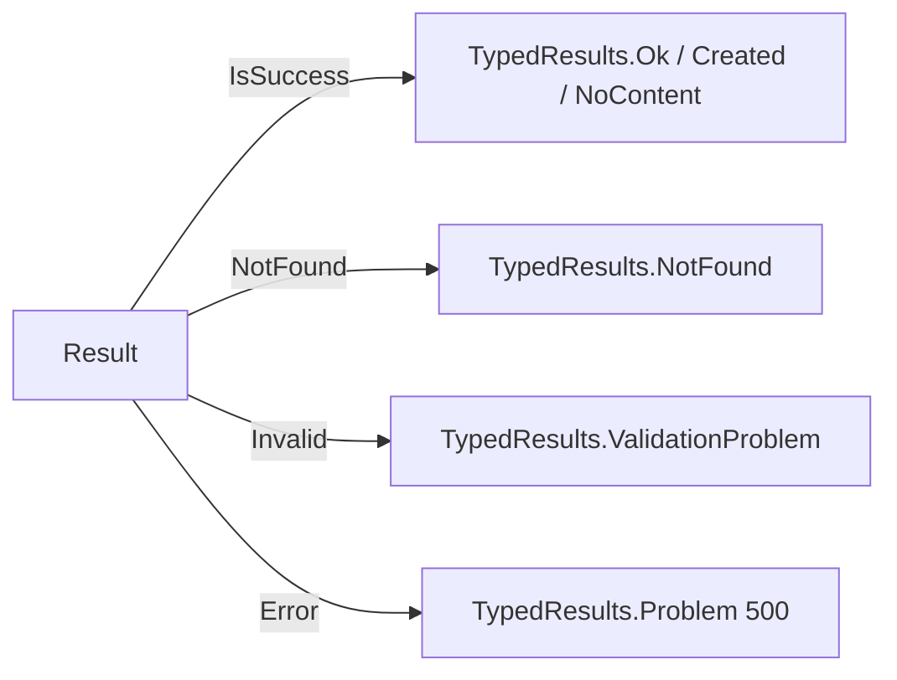

# HTTP API

The API is exposed via FastEndpoints. All endpoints live under [`Adapters.Inbound/Api/Samples/`](../src/Hex.Scaffold.Adapters.Inbound/Api/Samples).

Base URL in development: `http://localhost:8080`.

Interactive docs:

- **Scalar UI** — `GET /scalar/v1` (development only).
- **Swagger JSON** — `GET /swagger/v1/swagger.json`.

## Endpoints

| Method | Path | Summary |
|---|---|---|
| `POST` | `/samples` | Create a new sample |
| `GET` | `/samples` | List samples (paginated) |
| `GET` | `/samples/{sampleId:int}` | Get a sample by ID |
| `PUT` | `/samples/{sampleId:int}` | Update a sample |
| `DELETE` | `/samples/{sampleId:int}` | Delete a sample |
| `GET` | `/samples/external-info` | Proxy demo — calls the outbound HTTP adapter |
| `GET` | `/healthz` | Liveness probe |
| `GET` | `/ready` | Readiness probe |

All sample endpoints are `AllowAnonymous()` and tagged `Samples` in OpenAPI. Add auth in `MiddlewareConfig.cs` when ready — the `TODO` marks the spot.

## POST /samples

**Request**

```json
{
  "name": "My Sample",
  "description": "optional"
}
```

Validation (`CreateSampleValidator`):

- `name` required
- `name` max length `SampleName.MaxLength` (200)

**Responses**

| Status | Body |
|---|---|
| `201 Created` | `{ "id": 42, "name": "My Sample" }`, `Location: /samples/42` |
| `400 ValidationProblem` | RFC 7807 problem with `errors` dictionary |
| `500 Problem` | RFC 7807 problem |

## GET /samples/{sampleId}

**Responses**

| Status | Body |
|---|---|
| `200 Ok` | `SampleRecord` |
| `404 NotFound` | — |

`SampleRecord`:

```json
{
  "id": 42,
  "name": "My Sample",
  "status": "NotSet",
  "description": "optional"
}
```

`status` is the SmartEnum name (`Active` \| `Inactive` \| `NotSet`).

The handler uses `ICacheService` — it reads from Redis first (5-minute TTL) and falls back to the database.

## GET /samples

**Query**

| Param | Type | Default |
|---|---|---|
| `page` | int | `1` |
| `perPage` | int | `10` (`Constants.DefaultPageSize`) |

**Response** — `200 Ok`

```json
{
  "items": [ { "id": 1, "name": "…", "status": "…", "description": "…" } ],
  "page": 1,
  "perPage": 10,
  "totalCount": 123,
  "totalPages": 13
}
```

Backed by Dapper (`ListSamplesQueryService`), not EF.

## PUT /samples/{sampleId}

**Request**

```json
{ "name": "New name", "description": "new description" }
```

**Responses**

| Status | Body |
|---|---|
| `200 Ok` | `SampleRecord` (the updated sample) |
| `404 NotFound` | — |
| `500 Problem` | — |

Registers `SampleUpdatedEvent` when `name` actually changes. `description` is unconditionally applied (see `Sample.UpdateDescription`).

## DELETE /samples/{sampleId}

**Responses**

| Status | Body |
|---|---|
| `204 NoContent` | — |
| `404 NotFound` | — |

Delegates to `DeleteSampleService` (a domain service). The domain service publishes `SampleDeletedEvent` via Mediator.

## GET /samples/external-info

**Query**

| Param | Default |
|---|---|
| `endpoint` | `/get` |

Calls the base URL configured in `ExternalApi:BaseUrl` (default `https://httpbin.org`) via the resilient HTTP client. Returns the response body (or an error string). Good for smoke-testing the outbound adapter.

## Error mapping

All inbound handlers run commands through Mediator and receive a `Result` / `Result<T>`. The `ResultExtensions` helpers then return typed HTTP results:



Unhandled exceptions go through ASP.NET's problem-details handler (`app.UseExceptionHandler()` in production, `UseDeveloperExceptionPage()` in development).

## Rate limiting

A global per-IP fixed-window limiter runs in front of all endpoints:

- **100 requests / minute / remote IP**
- Rejected requests return `429 Too Many Requests` (`RejectionStatusCode = 429`).

Configured in [`Api/Configurations/RateLimitingConfig.cs`](../src/Hex.Scaffold.Api/Configurations/RateLimitingConfig.cs). A named `"default"` policy is also registered for selective attachment to endpoints.

## Health

| Path | Tag | What it checks |
|---|---|---|
| `/healthz` | `live` | Process is up |
| `/ready` | `ready` | PostgreSQL connect, MongoDB `ListDatabaseNames`, Redis `Ping`, Kafka TCP reach |

Kafka is a **soft** dependency — a failure returns `Degraded`, not `Unhealthy`. Postgres/Mongo/Redis are hard.
