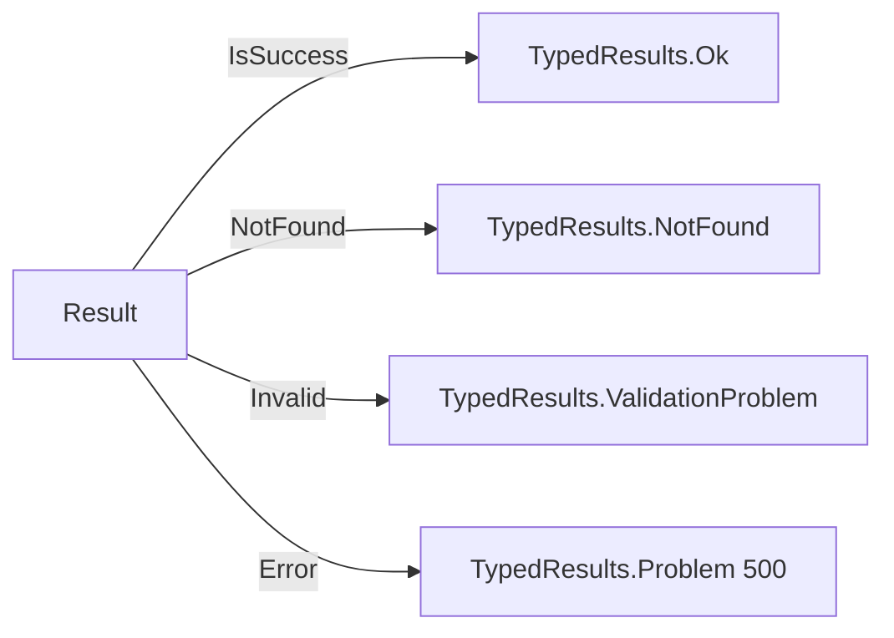

# HTTP API

The API is exposed via FastEndpoints. All endpoints live under [`Adapters.Inbound/Api/Accounts/`](../src/Hex.Scaffold.Adapters.Inbound/Api/Accounts).

The wire format is **snake_case end-to-end** — the FastEndpoints serializer is configured in [`MiddlewareConfig.cs`](../src/Hex.Scaffold.Api/Configurations/MiddlewareConfig.cs) with `JsonNamingPolicy.SnakeCaseLower`, so C# PascalCase property names map to `applied_configurations`, `contact_email`, `display_name`, `has_more`, `starting_after`, etc. without any `[JsonPropertyName]` decoration.

Base URL in development: `http://localhost:8080`.

Interactive docs:

- **Scalar UI** — `GET /scalar/v1` (development only).
- **Swagger JSON** — `GET /swagger/v1/swagger.json`.

## Endpoints

| Method | Path | Summary |
|---|---|---|
| `POST` | `/v2/core/accounts` | Create an Account |
| `GET` | `/v2/core/accounts` | List Accounts (cursor-paginated) |
| `GET` | `/v2/core/accounts/{id}` | Retrieve an Account |
| `POST` | `/v2/core/accounts/{id}` | Update an Account (partial; Stripe uses POST) |
| `GET` | `/healthz` | Liveness probe |
| `GET` | `/ready` | Readiness probe |

All Account endpoints are `AllowAnonymous()` and tagged `Accounts` in OpenAPI. Add auth in `MiddlewareConfig.cs` when ready — the `TODO` marks the spot.

The four endpoints reproduce the **Stripe v2 Accounts API** wire shape (`object: "v2.core.account"`, `acct_…` IDs, snake_case keys, partial-update semantics for POST update). See `docs/domain.md` for the aggregate, `docs/database.md` for the Postgres schema (top-level scalars + jsonb columns for nested objects).

## POST /v2/core/accounts

**Request**

```json
{
  "applied_configurations": ["customer", "merchant"],
  "contact_email": "furever@example.com",
  "display_name": "Furever",
  "configuration": {
    "customer": { "applied": true },
    "merchant": { "applied": true }
  },
  "identity": {
    "country": "US",
    "entity_type": "company",
    "business_details": {
      "registered_name": "Furever",
      "address": { "country": "US", "postal_code": "10001" }
    }
  },
  "metadata": { "source": "demo" }
}
```

All top-level fields are optional; nested objects (`configuration`, `identity`, `defaults`, `metadata`) are stored as JSON in Postgres `jsonb` columns and round-tripped verbatim on read.

Validation (`CreateAccountValidator`):

- `display_name` ≤ 200 chars
- `contact_email` valid email, ≤ 254 chars
- `contact_phone` ≤ 40 chars
- `applied_configurations[*]` ∈ `{customer, merchant, recipient}`
- **`contact_email` is required when `applied_configurations` contains `merchant` or `recipient`** (mirrors Stripe's docs)

**Responses**

| Status | Body |
|---|---|
| `200 OK` | Full `Account` object (Stripe-faithful — Stripe doesn't return 201) |
| `400 ValidationProblem` | RFC 7807 with the failed rules in `errors` |
| `429 Too Many Requests` | Per-IP rate limit hit |
| `500 Problem` | RFC 7807 |

## GET /v2/core/accounts/{id}

**Responses**

| Status | Body |
|---|---|
| `200 OK` | Full `Account` object |
| `404 NotFound` | — |

`Account` shape (everything Stripe v2 surfaces, minus the four endpoints out of scope):

```json
{
  "id": "acct_AbCdEf1234567890123456",
  "object": "v2.core.account",
  "livemode": false,
  "created": "2026-04-27T13:00:00.000Z",
  "display_name": "Furever",
  "contact_email": "furever@example.com",
  "dashboard": "full",
  "applied_configurations": ["customer", "merchant"],
  "configuration": { /* whatever was sent on create/update */ },
  "identity": { /* … */ },
  "defaults": null,
  "metadata": { /* … */ }
}
```

`dashboard` is derived from `applied_configurations` — `merchant` or `customer` → `full`, `recipient` only → `express`, none → `none`. The handler reads through Redis first (5-minute TTL) and falls back to Postgres; cache invalidation runs through `AccountEventPublishHandler` on `AccountUpdatedEvent`.

## GET /v2/core/accounts

**Query** — cursor-based, mirrors Stripe:

| Param | Type | Default | Range |
|---|---|---|---|
| `limit` | int | `10` | `1..100` |
| `starting_after` | string (`acct_…`) | — | forward cursor |
| `ending_before` | string (`acct_…`) | — | backward cursor |

`starting_after` and `ending_before` are mutually exclusive (400 if both are sent).

**Response** — `200 OK`

```json
{
  "object": "list",
  "data": [ /* up to `limit` Account objects, newest-first */ ],
  "has_more": true
}
```

Pagination is keyset-on-`created` only — the (created, id) tiebreaker was dropped because composite-key comparisons across a Vogen-typed PK don't translate cleanly to SQL. Acceptable trade-off for a scaffold demo. Backed by [`ListAccountsQueryService`](../src/Hex.Scaffold.Adapters.Persistence/PostgreSql/Queries/ListAccountsQueryService.cs) (EF, `AsNoTracking`).

## POST /v2/core/accounts/{id}

**Request** — Stripe-style partial update. **Every field is optional**, and the API distinguishes three states per field:

| Caller intent | JSON shape | Effect |
|---|---|---|
| Omitted | key not present | Leave alone |
| Explicit null | `"display_name": null` | Clear |
| Set | `"display_name": "Furever Inc."` | Apply |

The endpoint binds each field as `JsonElement`; `Undefined` = omitted, `Null` = clear, anything else = set. The `(HasValue, Value?)` tuple the aggregate's `ApplyUpdate` accepts is collapsed by [`AccountFieldHelpers`](../src/Hex.Scaffold.Adapters.Inbound/Api/Accounts/AccountFieldHelpers.cs).

```json
{ "display_name": "Furever Inc." }
```

```json
{
  "applied_configurations": ["customer", "merchant", "recipient"],
  "metadata": { "tier": "platinum" }
}
```

**Responses**

| Status | Body |
|---|---|
| `200 OK` | Full updated `Account` object |
| `404 NotFound` | — |
| `400 ValidationProblem` | invalid id format / invalid email / unknown applied_configuration |

Registers `AccountUpdatedEvent` when at least one field actually changes (the aggregate compares old-vs-new before emitting, so `display_name = same` is a no-op).

## Error mapping

All inbound handlers run commands through Mediator and receive a `Result` / `Result<T>`. The `ResultExtensions` helpers then return typed HTTP results:



Unhandled exceptions go through ASP.NET's problem-details handler (`app.UseExceptionHandler()` in production, `UseDeveloperExceptionPage()` in development).

## Rate limiting

A global per-IP fixed-window limiter runs in front of all endpoints. The defaults match Stripe's posture for a scaffold demo, but every knob is configurable through the Helm chart's `rateLimit.*` values:

- **`permitLimit`** = 100 requests
- **`windowSeconds`** = 60 s
- **`queueLimit`** = 0
- Rejected requests return `429 Too Many Requests`.

Configured in [`Api/Configurations/RateLimitingConfig.cs`](../src/Hex.Scaffold.Api/Configurations/RateLimitingConfig.cs); options bound to the `RateLimit:*` configuration section. **Bump `permitLimit` well above the test arrival rate before running k6** — see `docs/loadtest.md`.

## Health

| Path | Tag | What it checks |
|---|---|---|
| `/healthz` | `live` | Process is up |
| `/ready` | `ready` | PostgreSQL connect, MongoDB `ListDatabaseNames`, Redis `Ping`, Kafka TCP reach |

Kafka is a **soft** dependency — a failure returns `Degraded`, not `Unhealthy`. Postgres/Mongo/Redis are hard.
