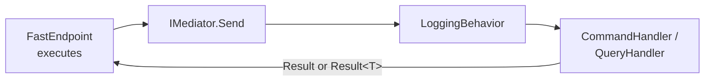
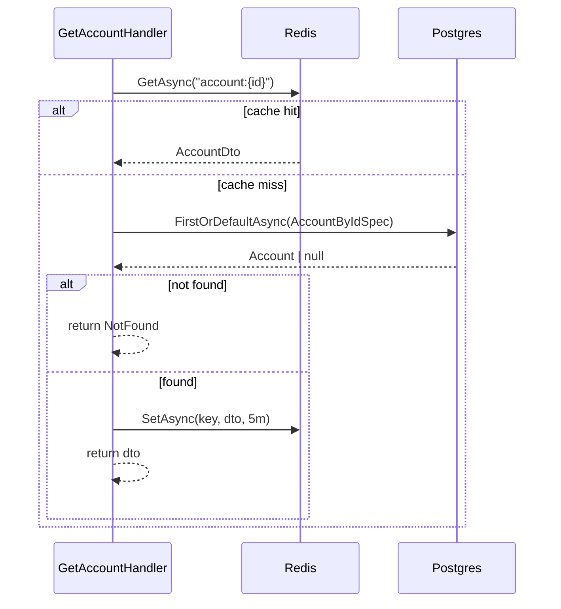

# Application layer

The Application layer contains the **use cases** — commands for state changes, queries for reads. Each use case is a feature folder under [`Application/Accounts/`](../src/Hex.Scaffold.Application/Accounts) with a request, a handler, and (optionally) a feature-scoped port.

## CQRS with Mediator

Handlers implement `ICommandHandler<TCommand, TResponse>` or `IQueryHandler<TQuery, TResponse>` from the [Mediator](https://github.com/martinothamar/Mediator) source generator. Mediator wires dispatch at compile time — no reflection, no handler scanning at runtime.

The Mediator is registered in [`Api/Configurations/MediatorConfig.cs`](../src/Hex.Scaffold.Api/Configurations/MediatorConfig.cs) across four assemblies (Domain, Application, Persistence, Inbound), with `LoggingBehavior` as a global pipeline behavior.



## Use cases

| Folder | Type | Port used | Result |
|---|---|---|---|
| `Create/` | Command | `IRepository<Account>`, `IMediator` | `Result<AccountDto>` |
| `Update/` | Command | `IRepository<Account>` | `Result<AccountDto>` |
| `Get/` | Query | `IReadRepository<Account>`, `ICacheService` | `Result<AccountDto>` |
| `List/` | Query | `IListAccountsQueryService` | `Result<AccountListResult>` |

### CreateAccount

[`CreateAccountHandler`](../src/Hex.Scaffold.Application/Accounts/Create/CreateAccountHandler.cs):

```csharp
var account = Account.Create(
  livemode: command.Livemode,
  displayName: command.DisplayName,
  contactEmail: command.ContactEmail,
  contactPhone: command.ContactPhone,
  appliedConfigurations: command.AppliedConfigurations,
  configurationJson: command.ConfigurationJson,
  identityJson: command.IdentityJson,
  defaultsJson: command.DefaultsJson,
  metadataJson: command.MetadataJson);

var created = await _repository.AddAsync(account, cancellationToken);
await _mediator.Publish(new AccountCreatedEvent(created), cancellationToken);

return AccountDto.FromAggregate(created);
```

`Account.Create` generates the `acct_…` ID inside the domain before the entity is added to ChangeTracker, and registers `AccountCreatedEvent` in-aggregate. The handler also publishes the event explicitly through Mediator so cache invalidation + Kafka publish can run in the same logical operation as the create.

### UpdateAccount — partial update semantics

The command carries `(bool HasValue, T? Value)` tuples for every mutable field, mirroring Stripe's omitted-vs-explicit-null distinction. `UpdateAccountHandler` loads by `AccountByIdSpec`, calls the aggregate's single mutation method, and saves:

```csharp
var account = await _repository.FirstOrDefaultAsync(
  new AccountByIdSpec(command.Id), cancellationToken);
if (account is null) return Result<AccountDto>.NotFound();

account.ApplyUpdate(
  displayName:           command.DisplayName,
  contactEmail:          command.ContactEmail,
  contactPhone:          command.ContactPhone,
  appliedConfigurations: command.AppliedConfigurations,
  configurationJson:     command.ConfigurationJson,
  identityJson:          command.IdentityJson,
  defaultsJson:          command.DefaultsJson,
  metadataJson:          command.MetadataJson);

await _repository.UpdateAsync(account, cancellationToken);

return AccountDto.FromAggregate(account);
```

Any `AccountUpdatedEvent` registered by `ApplyUpdate` is dispatched by `EventDispatcherInterceptor` after `SaveChanges`.

### GetAccount (cached)

Demonstrates the read-through cache pattern:



Cache invalidation is event-driven — `AccountEventPublishHandler` removes `account:{id}` and `accounts:list` on `AccountUpdatedEvent`.

### ListAccounts — cursor pagination

Stripe's wire shape: `{object: "list", data: [...], has_more}`. No total count, no page numbers — both are deliberately absent.

```csharp
public sealed record ListAccountsQuery(
  int Limit,
  string? StartingAfter,
  string? EndingBefore)
  : IQuery<Result<AccountListResult>>;
```

Defaults: `Limit = 10`, max `100` (matches Stripe). The handler delegates to `IListAccountsQueryService` (Postgres adapter implements it) and wraps the result in `AccountListResult.Wrap(items, hasMore)`.

## DTOs

| DTO | Used by |
|---|---|
| `AccountDto(Id, Object, Livemode, Created, Closed, DisplayName, ContactEmail, ContactPhone, Dashboard, AppliedConfigurations, Configuration, Identity, Defaults, Requirements, FutureRequirements, Metadata)` | All endpoints; nested fields are `JsonElement?` |
| `AccountListResult(Object, Data, HasMore)` | List endpoint envelope |

`AccountDto.FromAggregate` parses the aggregate's persisted JSON strings into `JsonElement` so System.Text.Json serializes them verbatim (no re-parse into a typed graph). Inbound adapters bind PascalCase property names; the global `JsonNamingPolicy.SnakeCaseLower` policy at the FastEndpoints serializer level renders them as Stripe-style `applied_configurations`, `contact_email`, `display_name`, `has_more`, etc.

## LoggingBehavior

`LoggingBehavior<TMessage, TResponse>` ([`Behaviors/LoggingBehavior.cs`](../src/Hex.Scaffold.Application/Behaviors/LoggingBehavior.cs)) is a Mediator `IPipelineBehavior` that runs around every handler:

- Logs `"Handling {MessageName}"` before.
- Stopwatch around `next`.
- Logs `"Handled {MessageName} in {ElapsedMs}ms"` after.

It is added once in `MediatorConfig` and applies to every command and query.

## Constants

`Constants.DefaultPageSize = 10`, `Constants.MaxPageSize = 50`. The cursor-paginated list path uses its own constants on `ListAccountsHandler` (`DefaultLimit = 10`, `MaxLimit = 100`) which are tighter and Stripe-aligned; the project-level constants are kept for any future paginated endpoint that follows the older shape.

## Global usings

```csharp
global using Hex.Scaffold.Domain.Common;
global using Mediator;
global using Microsoft.Extensions.Logging;
```

Every handler therefore has `Result`, `IMediator`, `ILogger<>`, and `ICommand`/`IQuery` in scope without explicit imports.
