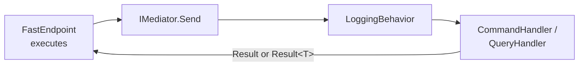
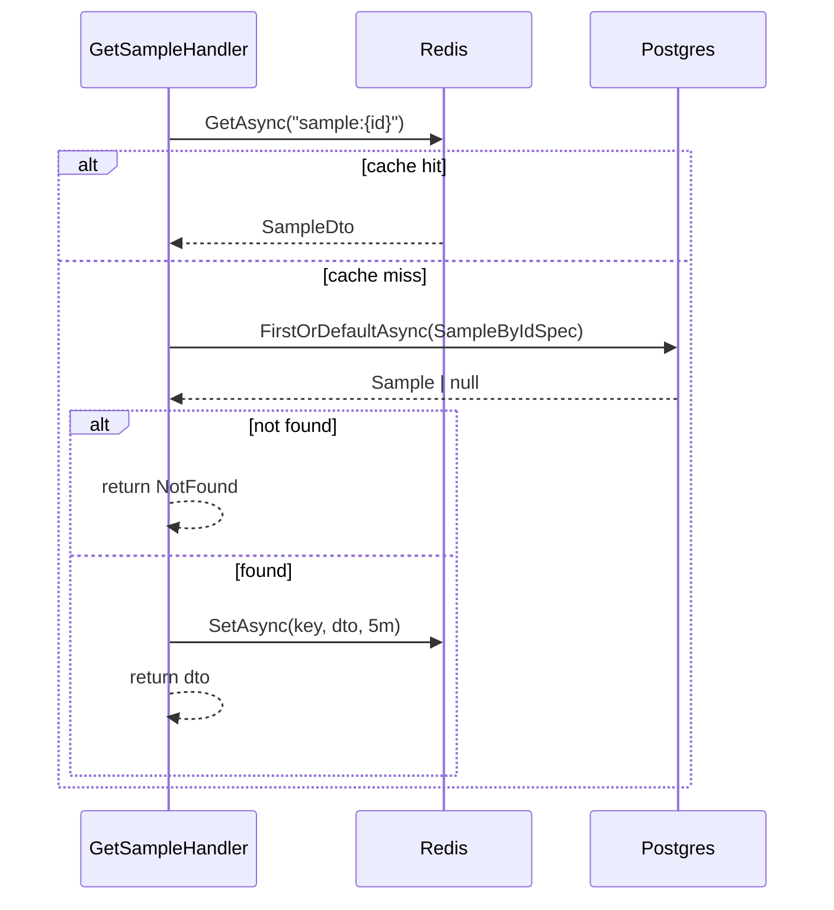

# Application layer

The Application layer contains the **use cases** — commands for state changes, queries for reads. Each use case is a feature folder under [`Application/Samples/`](../src/Hex.Scaffold.Application/Samples) with a request, a handler, and (optionally) a feature-scoped port.

## CQRS with Mediator

Handlers implement `ICommandHandler<TCommand, TResponse>` or `IQueryHandler<TQuery, TResponse>` from the [Mediator](https://github.com/martinothamar/Mediator) source generator. Mediator wires dispatch at compile time — no reflection, no handler scanning at runtime.

The Mediator is registered in [`Api/Configurations/MediatorConfig.cs`](../src/Hex.Scaffold.Api/Configurations/MediatorConfig.cs) across four assemblies (Domain, Application, Persistence, Inbound), with `LoggingBehavior` as a global pipeline behavior.



## Use cases

| Folder | Type | Port used | Result |
|---|---|---|---|
| `Create/` | Command | `IRepository<Sample>`, `IMediator` | `Result<SampleId>` |
| `Update/` | Command | `IRepository<Sample>` | `Result<SampleDto>` |
| `Delete/` | Command | `IDeleteSampleService` (domain service) | `Result` |
| `Get/GetSampleQuery` | Query | `IReadRepository<Sample>`, `ICacheService` | `Result<SampleDto>` |
| `Get/GetExternalSampleInfoQuery` | Query | `IExternalApiClient` | `Result<string>` |
| `List/` | Query | `IListSamplesQueryService` (Dapper) | `Result<PagedResult<SampleDto>>` |

### CreateSample

[`CreateSampleHandler`](../src/Hex.Scaffold.Application/Samples/Create/CreateSampleHandler.cs):

```csharp
var sample = new Sample(command.Name);
if (command.Description is not null) sample.UpdateDescription(command.Description);

var created = await _repository.AddAsync(sample, cancellationToken);
await _mediator.Publish(new SampleCreatedEvent(created), cancellationToken);

return created.Id;
```

`SampleCreatedEvent` is published explicitly here because there is no state change event raised on construction. `UpdateName`, `Activate`, and `Deactivate` raise events themselves — those flow through EF's interceptor (see [`events.md`](events.md)).

### UpdateSample

Loads by `SampleByIdSpec`, applies intent-revealing methods, saves:

```csharp
sample.UpdateName(command.Name)
      .UpdateDescription(command.Description);

await _repository.UpdateAsync(sample, cancellationToken);
```

Any events registered by `UpdateName` are dispatched by `EventDispatcherInterceptor` after `SaveChanges`.

### GetSample (cached)

Demonstrates the read-through cache pattern:



Cache invalidation is event-driven — `SampleEventPublishHandler` removes `sample:{id}` and `samples:list` on update/delete events.

### ListSamples

Uses a **Dapper** query service (`IListSamplesQueryService`) rather than EF to avoid change-tracking overhead and to allow hand-tuned SQL for paginated reads. The Application layer defines the port; the Persistence adapter implements it.

### GetExternalInfo

Demonstrates the outbound HTTP adapter via `IExternalApiClient`. The default `BaseUrl` points at `httpbin.org` for easy experimentation.

## DTOs

| DTO | Used by |
|---|---|
| `SampleDto(SampleId, SampleName, SampleStatus, string?)` | Query results |
| `PagedResult<T>(Items, Page, PerPage, TotalCount, TotalPages)` | Paginated queries |

DTOs keep value objects (so consumers can rely on `.Value` / `.Name`). Inbound adapters unwrap them to primitives for wire contracts.

## LoggingBehavior

`LoggingBehavior<TMessage, TResponse>` ([`Behaviors/LoggingBehavior.cs`](../src/Hex.Scaffold.Application/Behaviors/LoggingBehavior.cs)) is a Mediator `IPipelineBehavior` that runs around every handler:

- Logs `"Handling {MessageName}"` before.
- Stopwatch around `next`.
- Logs `"Handled {MessageName} in {ElapsedMs}ms"` after.

It is added once in `MediatorConfig` and applies to every command and query.

## Constants & pagination

`Constants.DefaultPageSize = 10`, `Constants.MaxPageSize = 50`. `ListSamplesQuery` defaults are routed through here.

## Global usings

```csharp
global using Hex.Scaffold.Domain.Common;
global using Mediator;
global using Microsoft.Extensions.Logging;
```

Every handler therefore has `Result`, `IMediator`, `ILogger<>`, and `ICommand`/`IQuery` in scope without explicit imports.
