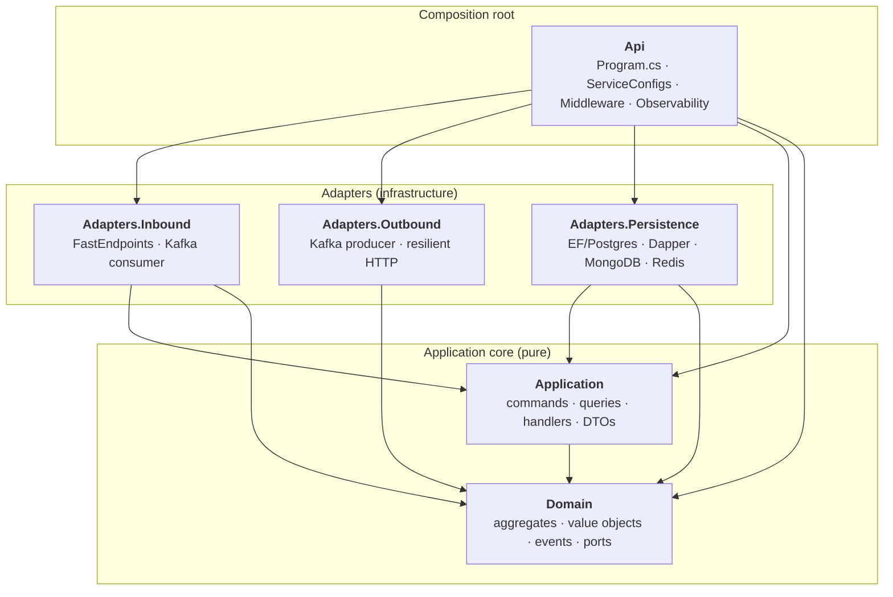
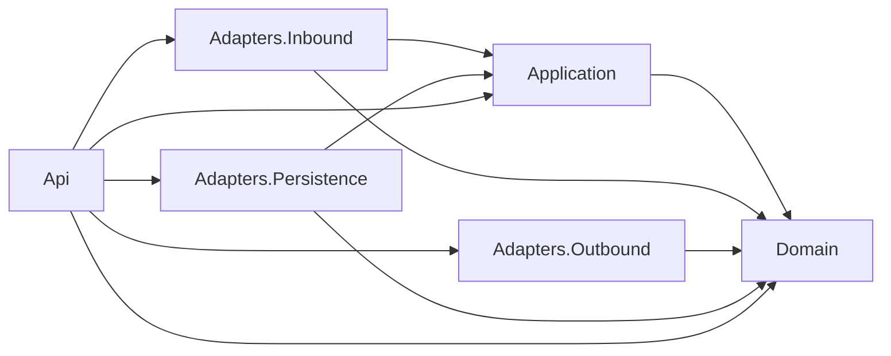

# Architecture

Hex.Scaffold follows the **hexagonal (ports & adapters)** style. The goal is to protect the domain and application logic from infrastructure decisions so that any adapter (HTTP, Kafka, Postgres, Mongo, Redis, external HTTP) can be swapped without touching the core.

## Layers

**Rule of thumb:** arrows point *inward*. Adapters know about the core; the core does **not** know about adapters.

## Strict dependency rules

These are enforced at build time by [`HexagonalDependencyTests`](../tests/Hex.Scaffold.Tests.Architecture/HexagonalDependencyTests.cs). A PR that violates them fails the test suite.

| Layer | May depend on |
|---|---|
| `Domain` | Nothing in this solution (only `Mediator.Abstractions`, `Vogen`, `Microsoft.Extensions.Logging.Abstractions`) |
| `Application` | `Domain` only |
| `Adapters.Inbound` | `Domain`, `Application` (never other adapters) |
| `Adapters.Outbound` | `Domain` only |
| `Adapters.Persistence` | `Domain`, `Application` (for query service ports) |
| `Api` | All — it is the composition root |

## Project map

| Project | Role |
|---|---|
| [`Hex.Scaffold.Domain`](../src/Hex.Scaffold.Domain) | Aggregates (`Sample`), value objects (`SampleId`, `SampleName`), `SampleStatus` SmartEnum, domain events, outbound ports (`IRepository`, `IEventPublisher`, `ICacheService`, `IExternalApiClient`, `ISampleReadModelRepository`). Building blocks: `Result<T>`, `Specification<T>`, `HasDomainEventsBase`. |
| [`Hex.Scaffold.Application`](../src/Hex.Scaffold.Application) | Use cases as CQRS commands/queries per feature folder (`Samples/Create`, `/Update`, `/Delete`, `/Get`, `/List`). `LoggingBehavior` pipeline behavior, `PagedResult`, DTOs. |
| [`Hex.Scaffold.Adapters.Inbound`](../src/Hex.Scaffold.Adapters.Inbound) | FastEndpoints endpoints mapped to use cases; FluentValidation validators; `ResultExtensions` to map `Result` → HTTP. `SampleEventConsumer` Kafka `BackgroundService` projecting events onto Mongo. |
| [`Hex.Scaffold.Adapters.Outbound`](../src/Hex.Scaffold.Adapters.Outbound) | `KafkaEventPublisher` (`IEventPublisher`), `ExternalApiClient` (`IExternalApiClient`). |
| [`Hex.Scaffold.Adapters.Persistence`](../src/Hex.Scaffold.Adapters.Persistence) | `AppDbContext`, `EfRepository<T>` (`IRepository`/`IReadRepository`), `EventDispatcherInterceptor`, `MediatorDomainEventDispatcher`, `ListSamplesQueryService` (Dapper), `SampleReadModelRepository` (Mongo), `RedisCacheService`. Connection registration extensions per store. |
| [`Hex.Scaffold.Api`](../src/Hex.Scaffold.Api) | Composition root. Wires every adapter in `Configurations/ServiceConfigs.cs`, configures observability, rate limiting, health checks, FastEndpoints, and Scalar OpenAPI. |

## Composition root

`Api/Program.cs` is deliberately tiny — it reads configuration, calls per-concern extension methods, and runs the app:

1. `AddObservability` — OpenTelemetry traces/metrics/logs via OTLP, Serilog bridge.
2. `AddServiceConfigs` — wires Postgres, Mongo, Redis, Kafka producer/consumer, resilient HTTP client, Mediator, and runs Scrutor for any missed port/adapter pairs.
3. `AddHealthCheckServices` — liveness/readiness checks per infrastructure dependency.
4. `AddRateLimitingServices` — per-IP fixed window limiter.
5. `AddFastEndpoints() + SwaggerDocument()` — API surface.
6. `UseAppMiddlewareAsync` — pipeline + applies EF migrations on startup when configured.

## Ports

All ports (dependency-inverted interfaces) live under `Domain/Ports/Outbound`:

- `IRepository<T>` / `IReadRepository<T>` — persistence for aggregate roots (`T : IAggregateRoot`).
- `IEventPublisher` — integration event publisher (Kafka).
- `ICacheService` — read-through cache.
- `IExternalApiClient` — outbound HTTP.
- `ISampleReadModelRepository` — Mongo projection for the read side.

The application layer can declare query-specific ports when needed (e.g. `IListSamplesQueryService` for the Dapper-backed read path).

## Why this shape?

- **Testability** — the domain and application layers have no framework dependencies, so unit tests run fast and deterministic.
- **Swap-in replacements** — Postgres → SQL Server, Kafka → Azure Service Bus, Mongo → DynamoDB; only the affected adapter changes.
- **Enforced contract** — architecture tests make these rules non-negotiable; drift cannot land silently.
