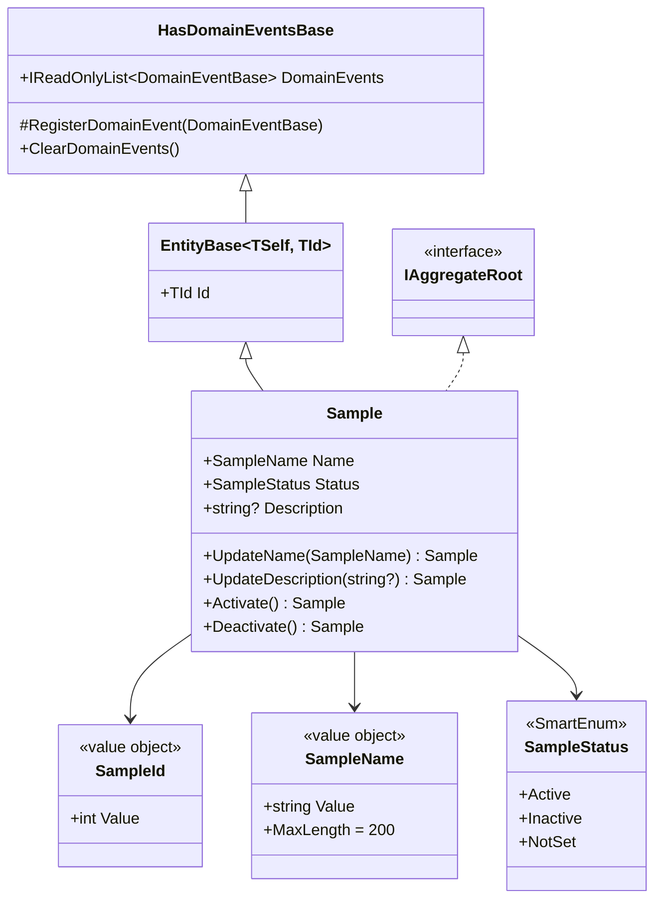

# Domain

The Domain layer is the purest part of the solution. It has no framework dependencies beyond `Mediator.Abstractions`, `Vogen`, and `Microsoft.Extensions.Logging.Abstractions`. Everything here is expressed in terms of the business — aggregates, value objects, events, and ports.

## Sample aggregate

`Sample` is the only aggregate root in the scaffold. It demonstrates every pattern the template supports.



`Sample` lives at [`src/Hex.Scaffold.Domain/SampleAggregate/Sample.cs`](../src/Hex.Scaffold.Domain/SampleAggregate/Sample.cs).

Key invariants:

- Setters are **private**. State changes happen through intention-revealing methods (`UpdateName`, `Activate`, `Deactivate`).
- Methods register **domain events** when something meaningful happens. They no-op if the state would not actually change (e.g. `UpdateName` when the name matches).
- Methods return `this` to support fluent chaining (see `UpdateSampleHandler`).
- The architecture test `DomainEntities_ShouldHaveOnlyPrivateSetters` enforces the private-setter rule on `Sample`.

## Value objects (Vogen)

`SampleId` and `SampleName` are [Vogen](https://github.com/SteveDunn/Vogen) value objects. They are structs with compile-time-generated equality, validation, and a `.From(value)` factory that throws `ValueObjectValidationException` on invalid input.

```csharp
// src/Hex.Scaffold.Domain/SampleAggregate/SampleId.cs
[ValueObject<int>]
public readonly partial struct SampleId
{
  private static Validation Validate(int value)
    => value > 0 ? Validation.Ok : Validation.Invalid("SampleId must be positive.");
}
```

```csharp
// src/Hex.Scaffold.Domain/SampleAggregate/SampleName.cs
[ValueObject<string>(conversions: Conversions.SystemTextJson)]
public partial struct SampleName
{
  public const int MaxLength = 200;

  private static Validation Validate(in string value) =>
    string.IsNullOrWhiteSpace(value)
      ? Validation.Invalid("SampleName cannot be empty")
      : value.Length > MaxLength
        ? Validation.Invalid($"SampleName cannot be longer than {MaxLength} characters")
        : Validation.Ok;
}
```

`SampleName` opts into `Conversions.SystemTextJson` so it serialises as a plain string (important for Kafka event payloads — see `events.md`). `SampleId` deliberately does *not* — it serialises as `{"Value": N}`, which the Kafka consumer accounts for.

## SmartEnum

`SampleStatus` is a hand-rolled `SmartEnum<TEnum>` (see [`Common/SmartEnum.cs`](../src/Hex.Scaffold.Domain/Common/SmartEnum.cs)). Instances are compared by reference; lookups are supported via `FromValue(int)` and `FromName(string)`.

```csharp
public sealed class SampleStatus : SmartEnum<SampleStatus>
{
  public static readonly SampleStatus Active = new(nameof(Active), 1);
  public static readonly SampleStatus Inactive = new(nameof(Inactive), 2);
  public static readonly SampleStatus NotSet = new(nameof(NotSet), 3);
}
```

The EF `SampleConfiguration` persists `Status` as its `int` value and rehydrates via `SampleStatus.FromValue(value)`.

## Result pattern

`Result` and `Result<T>` ([`Common/Result.cs`](../src/Hex.Scaffold.Domain/Common/Result.cs)) express success/failure outcomes without exceptions. States:

| Status | Intent |
|---|---|
| `Ok` | Success. `Result<T>` carries `Value`. |
| `NotFound` | Entity does not exist. |
| `Invalid` | Validation failed. Carries `ValidationError` list. |
| `Error` | Unexpected failure. Carries `Errors` list. |

`Result<T>.Success(value)` has an implicit conversion from `T`, so handlers can `return created.Id;` directly.

Use cases return `Result`/`Result<T>`. Inbound adapters (`ResultExtensions`) translate them into typed HTTP responses (`201`, `200`, `404`, `400`, `500`).

## Domain events

Domain events inherit `DomainEventBase : INotification` ([`Common/DomainEventBase.cs`](../src/Hex.Scaffold.Domain/Common/DomainEventBase.cs)) and are registered on aggregates via `HasDomainEventsBase.RegisterDomainEvent`.

Three events ship out of the box:

- `SampleCreatedEvent(Sample)`
- `SampleUpdatedEvent(Sample)`
- `SampleDeletedEvent(SampleId)`

See [`events.md`](events.md) for the dispatch pipeline.

## Specifications

`Specification<T>` ([`Common/Specification.cs`](../src/Hex.Scaffold.Domain/Common/Specification.cs)) is a minimal composable predicate:

```csharp
public sealed class SampleByIdSpec : Specification<Sample>
{
  public SampleByIdSpec(SampleId id) => Query.Where(s => s.Id == id);
}
```

Repositories accept `ISpecification<T>` in `FirstOrDefaultAsync`. `RepositoryBase` turns the `WhereExpression` into an `IQueryable.Where`. Keep specs small and focused — one query shape per spec.

## Ports (outbound)

Interfaces live in [`Domain/Ports/Outbound/`](../src/Hex.Scaffold.Domain/Ports/Outbound):

| Port | Purpose | Implementation |
|---|---|---|
| `IRepository<T>` | Write-side persistence for aggregates | `EfRepository<T>` |
| `IReadRepository<T>` | Read-side repository (same impl here) | `EfRepository<T>` |
| `IEventPublisher` | Publish integration events | `KafkaEventPublisher` |
| `ICacheService` | Distributed cache | `RedisCacheService` |
| `IExternalApiClient` | Outbound HTTP | `ExternalApiClient` |
| `ISampleReadModelRepository` | Mongo projection for read models | `SampleReadModelRepository` |

The Application layer may also declare feature-scoped ports (e.g. `IListSamplesQueryService`).

## Domain services

When an operation spans multiple aggregates or requires cross-cutting coordination, use a domain service. `DeleteSampleService` ([`Services/DeleteSampleService.cs`](../src/Hex.Scaffold.Domain/Services/DeleteSampleService.cs)) is the example — it loads the aggregate, deletes it, and publishes a `SampleDeletedEvent`. The application `DeleteSampleHandler` simply delegates to it.
