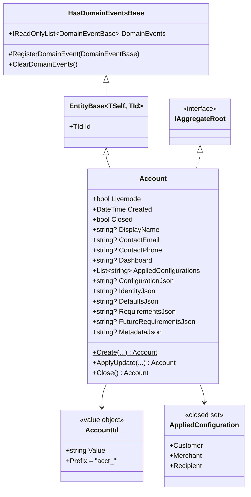

# Domain

The Domain layer is the purest part of the solution. It has no framework dependencies beyond `Mediator.Abstractions`, `Vogen`, and `Microsoft.Extensions.Logging.Abstractions`. Everything here is expressed in terms of the business — aggregates, value objects, events, and ports.

## Account aggregate

`Account` is the only aggregate root in the scaffold. It reproduces the **Stripe v2 `v2.core.account`** wire shape and demonstrates every pattern the template supports.



`Account` lives at [`src/Hex.Scaffold.Domain/AccountAggregate/Account.cs`](../src/Hex.Scaffold.Domain/AccountAggregate/Account.cs).

### Top-level scalars vs nested blobs

The class doc on `Account` explains the persistence model: top-level fields (id, livemode, created, contact_email, applied_configurations, …) are persisted as proper Postgres columns; **nested Stripe objects** (`configuration`, `identity`, `defaults`, `requirements`, `future_requirements`, `metadata`) live as raw JSON strings on `*Json` properties, round-tripped through `jsonb` columns. Trade-off: not modelling Stripe's ~80 nested record types (50+ payment-method capabilities, 200+ tax-id types, every ISO-3166 country, …) keeps the surface manageable while preserving the wire format byte-for-byte. The API boundary parses these strings into `JsonElement` for serialization.

### Key invariants

- **All declared properties have private setters.** State changes go through `Account.Create(...)`, `ApplyUpdate(...)`, or `Close()`. The architecture test `DomainEntities_ShouldHaveOnlyPrivateSetters` enforces this on `Account`'s declared members (the inherited `EntityBase.Id` setter is allowed for ORM rehydration).
- **ID generation is in-domain.** `Account.Create()` calls a private `NewId()` that hands a fully-initialised `AccountId` to the constructor before EF's `IdentityMap.Add` ever touches the entity. There is no Hi-Lo sequence and no `IAccountIdGenerator` port — the scaffold's earlier journey through Vogen + EF key-hashing taught the lesson that the only safe ordering is "ID set in domain before ChangeTracker sees it".
- **`ApplyUpdate` is the single mutation site for Stripe's partial-update semantics.** Each field is a `(bool HasValue, T? Value)` tuple: omitted = leave alone, present-with-null = clear, present-with-value = set. The aggregate emits `AccountUpdatedEvent` once per call only when at least one field actually changed.
- **`Close()` is the v2 replacement for "delete".** Implemented but no endpoint exposes it — surface area is intentionally limited to the four endpoints requested.

### Dashboard derivation

The `dashboard` field is derived from `applied_configurations` at create / update time:

| Applied configurations include… | Dashboard |
|---|---|
| `merchant` or `customer` | `full` |
| `recipient` only | `express` |
| none | `none` |

Mirrors Stripe's example payload (`acct_…` with customer + merchant → `dashboard: "full"`).

## Value objects (Vogen)

`AccountId` is a [Vogen](https://github.com/SteveDunn/Vogen) string-typed value object. The `acct_` prefix is enforced at construction time:

```csharp
// src/Hex.Scaffold.Domain/AccountAggregate/AccountId.cs
[ValueObject<string>(conversions: Conversions.SystemTextJson)]
public readonly partial struct AccountId
{
  public const string Prefix = "acct_";

  private static Validation Validate(string value)
    => !string.IsNullOrWhiteSpace(value) && value.StartsWith(Prefix, StringComparison.Ordinal)
      ? Validation.Ok
      : Validation.Invalid($"AccountId must start with '{Prefix}'.");
}
```

`Conversions.SystemTextJson` makes the ID serialize as a plain string on the wire (e.g. `"id": "acct_AbC…"`) — which is what Stripe's API surface expects.

## AppliedConfiguration

Not a SmartEnum (the scaffold's `SmartEnum<TEnum>` is int-keyed; Stripe's wire values are strings). `AppliedConfiguration` is a closed sealed class with three named singletons:

```csharp
public sealed class AppliedConfiguration : IEquatable<AppliedConfiguration>
{
  public static readonly AppliedConfiguration Customer  = new("customer");
  public static readonly AppliedConfiguration Merchant  = new("merchant");
  public static readonly AppliedConfiguration Recipient = new("recipient");

  public static IReadOnlyList<AppliedConfiguration> List { get; } =
    [Customer, Merchant, Recipient];
}
```

The aggregate stores them as a Postgres `text[]` for queryability — `WHERE 'merchant' = ANY(applied_configurations)` is the routing predicate Connect-style flows want.

## Result pattern

`Result` and `Result<T>` ([`Common/Result.cs`](../src/Hex.Scaffold.Domain/Common/Result.cs)) express success/failure outcomes without exceptions. States:

| Status | Intent |
|---|---|
| `Ok` | Success. `Result<T>` carries `Value`. |
| `NotFound` | Entity does not exist. |
| `Invalid` | Validation failed. Carries `ValidationError` list. |
| `Error` | Unexpected failure. Carries `Errors` list. |

`Result<T>.Success(value)` has an implicit conversion from `T`, so handlers can `return AccountDto.FromAggregate(account);` directly.

Use cases return `Result`/`Result<T>`. Inbound adapters (`ResultExtensions`) translate them into typed HTTP responses (`200`, `404`, `400`, `500`).

## Domain events

Domain events inherit `DomainEventBase : INotification` ([`Common/DomainEventBase.cs`](../src/Hex.Scaffold.Domain/Common/DomainEventBase.cs)) and are registered on the aggregate via `HasDomainEventsBase.RegisterDomainEvent`.

Two events ship out of the box:

- `AccountCreatedEvent(Account)`
- `AccountUpdatedEvent(Account)` — also emitted on `Close()`

See [`events.md`](events.md) for the dispatch pipeline.

## Specifications

`Specification<T>` ([`Common/Specification.cs`](../src/Hex.Scaffold.Domain/Common/Specification.cs)) is a minimal composable predicate:

```csharp
public sealed class AccountByIdSpec : Specification<Account>
{
  public AccountByIdSpec(AccountId id) => Query.Where(a => a.Id == id);
}
```

Repositories accept `ISpecification<T>` in `FirstOrDefaultAsync`. `RepositoryBase` turns the `WhereExpression` into an `IQueryable.Where`. Keep specs small and focused — one query shape per spec.

## Ports (outbound)

Interfaces live in [`Domain/Ports/Outbound/`](../src/Hex.Scaffold.Domain/Ports/Outbound):

| Port | Purpose | Implementation |
|---|---|---|
| `IRepository<T>` | Write-side persistence for aggregates | `EfRepository<T>` |
| `IReadRepository<T>` | Read-side repository (same impl here) | `EfRepository<T>` |
| `IEventPublisher` | Publish integration events | `KafkaEventPublisher` (or `NoOpEventPublisher` when outbound=rest) |
| `ICacheService` | Distributed cache | `RedisCacheService` (or `NullCacheService` when UseRedis=false) |
| `IExternalApiClient` | Outbound HTTP | `ExternalApiClient` |

The Application layer may also declare feature-scoped ports — `IListAccountsQueryService` for the cursor-paginated list path is one such example, defined alongside its query under `Application/Accounts/List/`.

## SmartEnum (still available)

`SmartEnum<TEnum>` ([`Common/SmartEnum.cs`](../src/Hex.Scaffold.Domain/Common/SmartEnum.cs)) is the int-keyed SmartEnum base the scaffold ships. The Account aggregate doesn't use it — `AppliedConfiguration` needs string values to match the Stripe wire format — but the type is kept available for cases where an int-keyed enumeration *with* persistence + name lookup makes sense.
