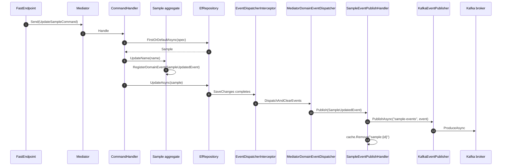
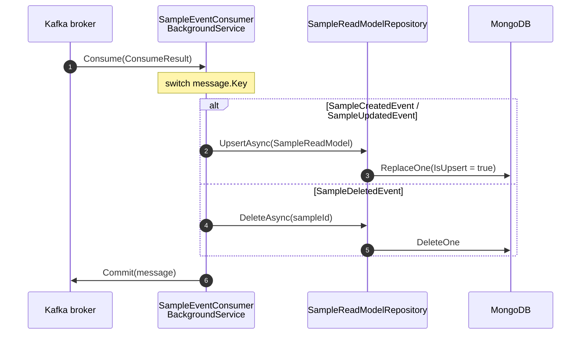

# Events

Hex.Scaffold uses two event mechanisms that work together:

- **Domain events** — in-process, Mediator `INotification` — dispatched after EF `SaveChanges` completes.
- **Integration events** — out-of-process, published to Kafka by a notification handler.

This gives aggregates a clean way to broadcast "something happened" without knowing whether the consumer is in-process or cross-service.

## End-to-end flow (write path)



## In-process dispatch

Aggregates derive from `HasDomainEventsBase`. State-change methods call `RegisterDomainEvent(new ...Event(this))`. Events collect on the entity instance until EF saves.

[`EventDispatcherInterceptor`](../src/Hex.Scaffold.Adapters.Persistence/PostgreSql/EventDispatcherInterceptor.cs) is an EF Core `SaveChangesInterceptor`:

```csharp
public override async ValueTask<int> SavedChangesAsync(...)
{
  var entitiesWithEvents = eventData.Context.ChangeTracker
    .Entries<HasDomainEventsBase>()
    .Select(e => e.Entity)
    .Where(e => e.DomainEvents.Any())
    .ToList();

  await _dispatcher.DispatchAndClearEvents(entitiesWithEvents);
  return await base.SavedChangesAsync(...);
}
```

[`MediatorDomainEventDispatcher`](../src/Hex.Scaffold.Adapters.Persistence/Common/MediatorDomainEventDispatcher.cs) publishes each event through `IMediator.Publish` and clears the entity's event list.

Any `INotificationHandler<TEvent>` in the solution receives it. The scaffold ships one:

## SampleEventPublishHandler

[`Domain/SampleAggregate/Handlers/SampleEventPublishHandler.cs`](../src/Hex.Scaffold.Domain/SampleAggregate/Handlers/SampleEventPublishHandler.cs) handles all three sample events. For each one it:

1. Publishes to Kafka via `IEventPublisher` on topic `sample-events`.
2. Invalidates Redis cache keys (`sample:{id}`, `samples:list`).

```csharp
public async ValueTask Handle(SampleUpdatedEvent n, CancellationToken ct)
{
  await _eventPublisher.PublishAsync(KafkaTopic, n, ct);
  await _cacheService.RemoveAsync($"sample:{n.Sample.Id.Value}", ct);
  await _cacheService.RemoveAsync("samples:list", ct);
}
```

> Note: this handler lives under `Domain.SampleAggregate.Handlers`, which is unusual — it depends on outbound ports (`IEventPublisher`, `ICacheService`). Those are interfaces defined in `Domain`, so the architecture test still passes. You may prefer to move this handler to Application as your codebase grows.

## Commands that publish explicitly

`CreateSampleHandler` and `DeleteSampleService` publish their events **directly** through Mediator rather than relying on the EF interceptor:

- `SampleCreatedEvent` is not raised from the constructor — no state-change method fires on `new Sample(...)`, so the handler publishes it after `AddAsync`.
- `SampleDeletedEvent` can't ride the interceptor because the deleted entity is gone from the ChangeTracker — the domain service publishes it after `DeleteAsync`.

Both paths end up invoking `SampleEventPublishHandler` the same way.

## Kafka publisher

[`KafkaEventPublisher`](../src/Hex.Scaffold.Adapters.Outbound/Messaging/KafkaEventPublisher.cs):

- Producer is `IProducer<string, string>` with `Acks.All` + `EnableIdempotence = true`.
- Key = `typeof(TEvent).Name`, value = `JsonSerializer.Serialize(event)`.
- Catches `ProduceException` and logs — publish failures are **swallowed** today.

> **Production warning:** this is eventual-consistency with no durability guarantees. If the DB transaction commits and the broker is unreachable, the event is lost. Implement the **Transactional Outbox** pattern before taking this to production (write the event into a local outbox table in the same EF transaction, then have a dispatcher forward it to Kafka with retry).

## Consumer → read model



[`SampleEventConsumer`](../src/Hex.Scaffold.Adapters.Inbound/Messaging/SampleEventConsumer.cs):

- `BackgroundService` on a long-running task.
- `EnableAutoCommit = false`; offsets are committed **after** successful processing.
- Dispatches by `message.Key` (the `typeof(TEvent).Name` the producer stamped).
- Deserializes event JSON via `JsonElement` navigation:
  - `SampleName` is a Vogen type with `Conversions.SystemTextJson` → plain string on the wire.
  - `SampleId` has **no** System.Text.Json conversion → serialises as `{"Value": N}`, so the consumer reads `SampleId.Value`.
  - `SampleStatus` is a SmartEnum → serialises as `{"Name": "...", "Value": N}`.
- `JsonException` / `KeyNotFoundException` → logged (no dead-letter today).

## Event payload sample

```json
{
  "Sample": {
    "Name": "Hello",
    "Status": { "Name": "Active", "Value": 1 },
    "Description": "…",
    "Id": { "Value": 42 },
    "DomainEvents": []
  },
  "OccurredOn": "2026-01-01T00:00:00Z"
}
```

## Read model

[`SampleDocument`](../src/Hex.Scaffold.Adapters.Persistence/MongoDb/SampleDocument.cs) is the Mongo storage shape; `SampleReadModel` is the in-memory DTO crossing the port. A composite index on `SampleId` would be the natural next step.

## Testing the flow

- Unit tests of aggregates verify events are registered (see [`SampleAggregateTests`](../tests/Hex.Scaffold.Tests.Unit/Domain/SampleAggregateTests.cs)).
- Integration tests can rely on Testcontainers for Postgres/Redis but do **not** spin up Kafka/Mongo by default — wire those in if you need end-to-end coverage.
