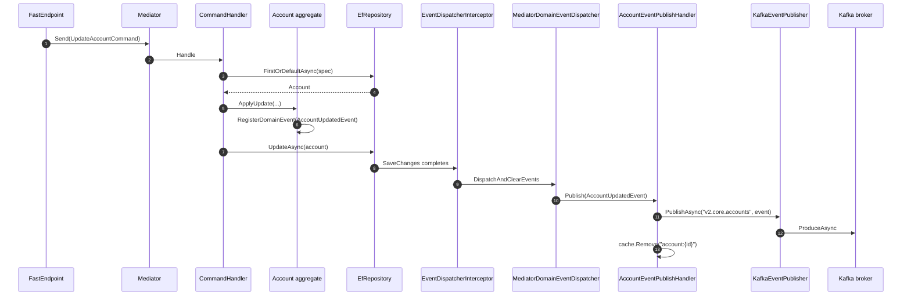
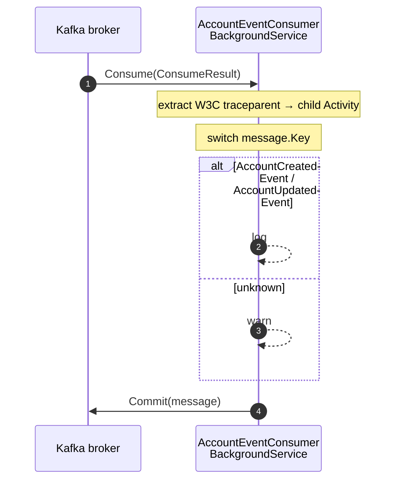

# Events

Hex.Scaffold uses two event mechanisms that work together:

- **Domain events** — in-process, Mediator `INotification` — dispatched after EF `SaveChanges` completes.
- **Integration events** — out-of-process, published to Kafka by a notification handler.

This gives the aggregate a clean way to broadcast "something happened" without knowing whether the consumer is in-process or cross-service.

## End-to-end flow (write path)



## In-process dispatch

The aggregate derives from `HasDomainEventsBase`. State-change methods (`Account.Create`, `ApplyUpdate`, `Close`) call `RegisterDomainEvent(new ...Event(this))`. Events collect on the entity instance until EF saves.

[`EventDispatcherInterceptor`](../src/Hex.Scaffold.Adapters.Persistence/PostgreSql/EventDispatcherInterceptor.cs) is an EF Core `SaveChangesInterceptor`:

```csharp
public override async ValueTask<int> SavedChangesAsync(...)
{
  var entitiesWithEvents = eventData.Context.ChangeTracker
    .Entries<HasDomainEventsBase>()
    .Select(e => e.Entity)
    .Where(e => e.DomainEvents.Any())
    .ToList();

  await _dispatcher.DispatchAndClearEvents(entitiesWithEvents);
  return await base.SavedChangesAsync(...);
}
```

[`MediatorDomainEventDispatcher`](../src/Hex.Scaffold.Adapters.Persistence/Common/MediatorDomainEventDispatcher.cs) publishes each event through `IMediator.Publish` and clears the entity's event list.

Any `INotificationHandler<TEvent>` in the solution receives it. The scaffold ships one:

## AccountEventPublishHandler

[`Domain/AccountAggregate/Handlers/AccountEventPublishHandler.cs`](../src/Hex.Scaffold.Domain/AccountAggregate/Handlers/AccountEventPublishHandler.cs) handles both Account events. For each one it:

1. Publishes to Kafka via `IEventPublisher` on topic `v2.core.accounts` (matches Stripe's webhook event-name space).
2. Invalidates Redis cache keys (`account:{id}`, `accounts:list`).

```csharp
public async ValueTask Handle(AccountUpdatedEvent n, CancellationToken ct)
{
  await _eventPublisher.PublishAsync(KafkaTopic, n, ct);
  await _cacheService.RemoveAsync($"account:{n.Account.Id.Value}", ct);
  await _cacheService.RemoveAsync("accounts:list", ct);
}
```

> Note: this handler lives under `Domain.AccountAggregate.Handlers`, which is unusual — it depends on outbound ports (`IEventPublisher`, `ICacheService`). Those are interfaces defined in `Domain`, so the architecture test still passes. You may prefer to move this handler to Application as your codebase grows.

## Commands that publish explicitly

`CreateAccountHandler` publishes `AccountCreatedEvent` **directly** through Mediator rather than relying solely on the EF interceptor. The aggregate registers the event in `Account.Create`, but the handler also calls `_mediator.Publish(new AccountCreatedEvent(created))` after `AddAsync` so the cache invalidation + Kafka publish run within the same logical operation as the create. Both paths converge on `AccountEventPublishHandler`.

## Kafka publisher

[`KafkaEventPublisher`](../src/Hex.Scaffold.Adapters.Outbound/Messaging/KafkaEventPublisher.cs):

- Producer is `IProducer<string, string>` with `Acks.All` + `EnableIdempotence = true`.
- Key = `typeof(TEvent).Name` (e.g. `AccountCreatedEvent`), value = `JsonSerializer.Serialize(event)`.
- Manually injects W3C `traceparent` / `tracestate` headers so the consumer can link its activity to the producer's (PR #17).
- Catches `ProduceException` and logs — publish failures are **swallowed** today.

> **Production warning:** this is eventual-consistency with no durability guarantees. If the DB transaction commits and the broker is unreachable, the event is lost. Implement the **Transactional Outbox** pattern before taking this to production (write the event into a local outbox table in the same EF transaction, then have a dispatcher forward it to Kafka with retry).

## Consumer



[`AccountEventConsumer`](../src/Hex.Scaffold.Adapters.Inbound/Messaging/AccountEventConsumer.cs):

- `BackgroundService` on a long-running task. Registered only when `features.inbound=kafka`.
- `EnableAutoCommit = false`; offsets are committed **after** successful processing.
- Dispatches by `message.Key` (the `typeof(TEvent).Name` the producer stamped).
- Tolerant of two ID serialisation shapes — `AccountId` opts into `Conversions.SystemTextJson` so it serialises as a plain string; legacy event-shape support reads from `{"Value": "…"}` if present.
- `JsonException` → logged (no dead-letter today).

The Sample-era `SampleReadModelRepository` Mongo projection that the prior consumer drove was retired alongside the Sample aggregate. The current consumer is intentionally minimal (log + commit) — drop in an `AccountReadModelRepository` here when a read-model is needed.

## Event payload sample

```json
{
  "Account": {
    "Id": "acct_AbCdEf1234567890123456",
    "Livemode": false,
    "Created": "2026-04-27T13:00:00.000Z",
    "DisplayName": "Furever",
    "ContactEmail": "furever@example.com",
    "AppliedConfigurations": ["customer", "merchant"],
    "Dashboard": "full"
  },
  "OccurredOn": "2026-04-27T13:00:00.000Z"
}
```

The serialiser preserves PascalCase here because the publisher uses raw `JsonSerializer.Serialize` (no naming policy applied). Inbound HTTP responses go through the FastEndpoints serializer with `SnakeCaseLower` policy and produce snake_case output. If you start consuming these events with another service, configure that consumer's deserialiser accordingly.

## Testing the flow

- Unit tests of the aggregate verify events are registered (see [`AccountAggregateTests`](../tests/Hex.Scaffold.Tests.Unit/Domain/AccountAggregateTests.cs)).
- The handler test ([`CreateAccountHandlerTests`](../tests/Hex.Scaffold.Tests.Unit/Application/CreateAccountHandlerTests.cs)) verifies that `AccountCreatedEvent` is published through the substituted `IMediator`.
- Integration tests can rely on Testcontainers for Postgres/Redis but do **not** spin up Kafka by default — wire it in if you need end-to-end coverage.
