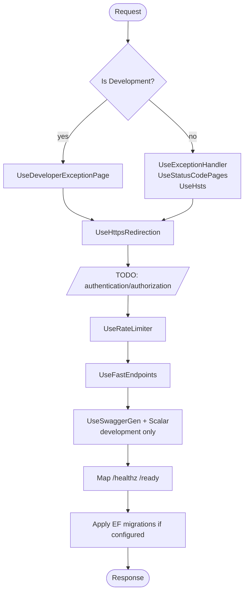

# Observability & operational concerns

The scaffold wires OpenTelemetry, Serilog, health checks, and rate limiting at the composition root. Defaults are sane for Azure AKS / any Kubernetes deployment with an OTEL collector sidecar.

## OpenTelemetry

[`Api/Configurations/ObservabilityConfig.cs`](../src/Hex.Scaffold.Api/Configurations/ObservabilityConfig.cs) builds a unified trace/metric/log export via **OTLP HTTP** to the endpoint from configuration key `OpenTelemetry:OtlpEndpoint` (default `http://localhost:4318`).

| Signal | Instrumentation | Exporter |
|---|---|---|
| Traces | `AspNetCore`, `HttpClient` | OTLP HTTP (protobuf) |
| Metrics | `AspNetCore`, `HttpClient`, Runtime | OTLP HTTP, 10s interval |
| Logs | Microsoft.Extensions.Logging | OTLP HTTP |

Resource attributes:

- `service.name = "Hex.Scaffold"`
- `deployment.environment = <ASPNETCORE_ENVIRONMENT>`

Traces from `/healthz` and `/ready` are filtered out to avoid noise.

## Serilog

`builder.Host.UseSerilog((ctx, cfg) => cfg.ReadFrom.Configuration(ctx.Configuration))` reads the `Serilog` section from `appsettings*.json`. By default:

- Console sink.
- `Default: Information`; overrides `Microsoft: Warning`, `System: Warning`.
- Development overrides this to `Default: Debug`.

Additionally, Microsoft-native ILogger output is routed to OpenTelemetry via `builder.Logging.AddOpenTelemetry`, so structured logs reach your collector regardless of Serilog config.

## Health checks

[`Api/Configurations/HealthCheckConfig.cs`](../src/Hex.Scaffold.Api/Configurations/HealthCheckConfig.cs) registers:

| Check | Tag | On failure |
|---|---|---|
| `self` | `live` | — always healthy |
| `postgresql` | `ready` | `Unhealthy` (hard dep) |
| `mongodb` | `ready` | `Unhealthy` (hard dep) |
| `redis` | `ready` | `Unhealthy` (hard dep) — 3s connect timeout |
| `kafka` | `ready` | `Degraded` (soft dep) — 3s TCP reach |

Routes:

- `GET /healthz` — liveness (only `live`-tagged checks)
- `GET /ready` — readiness (only `ready`-tagged checks)

Note that the external HTTP client has **no** health probe — its resilience handler covers transient failures at call time.

## Rate limiting

[`Api/Configurations/RateLimitingConfig.cs`](../src/Hex.Scaffold.Api/Configurations/RateLimitingConfig.cs) uses `Microsoft.AspNetCore.RateLimiting`:

- Global fixed-window limiter partitioned by remote IP.
- `100` requests per `1 minute`, `QueueLimit = 0`.
- `RejectionStatusCode = 429`.
- A named policy `"default"` is also registered — attach it to endpoints with `[EnableRateLimiting("default")]` if you want policy-specific limits.

The middleware runs via `app.UseRateLimiter()` in [`MiddlewareConfig.cs`](../src/Hex.Scaffold.Api/Configurations/MiddlewareConfig.cs).

## Middleware pipeline

`app.UseFastEndpoints(c => c.Errors.UseProblemDetails())` forces RFC 7807 for validation errors. `Scalar` is mapped at `/scalar/v1` in development.

## Migration-on-startup

Controlled by `Database:ApplyMigrationsOnStartup` (bool, default `false` in `appsettings.json`, `true` in `appsettings.Development.json`). Set to `true` for local dev and for ephemeral test environments; set to `false` in production and run migrations as a separate step of the deployment pipeline.

## Secrets & config

Connection strings and secrets live in:

- `ConnectionStrings:PostgreSql`
- `MongoDB:ConnectionString`
- `Redis:ConnectionString`
- `Kafka:BootstrapServers`
- `ExternalApi:BaseUrl`
- `OpenTelemetry:OtlpEndpoint`

Do **not** commit production values. Use Azure Key Vault / environment variables / user-secrets. The `Azure.Identity` package is already referenced for future Key Vault wiring.

## Dockerfile

The multi-stage [`Dockerfile`](../Dockerfile) (restore → build → publish → runtime) targets `mcr.microsoft.com/dotnet/aspnet:10.0` and exposes port `8080`. The image runs `dotnet Hex.Scaffold.Api.dll` with `ASPNETCORE_ENVIRONMENT=Production`.

## What is deliberately **not** wired

- AuthN/AuthZ (TODO in `MiddlewareConfig.cs`).
- Distributed tracing correlation across Kafka (add OpenTelemetry's `Confluent.Kafka` instrumentation when you need it).
- Dead-letter topic for Kafka consumer failures.
- Outbox table for guaranteed event delivery.
- External HTTP health probe (intentionally — see config file).
