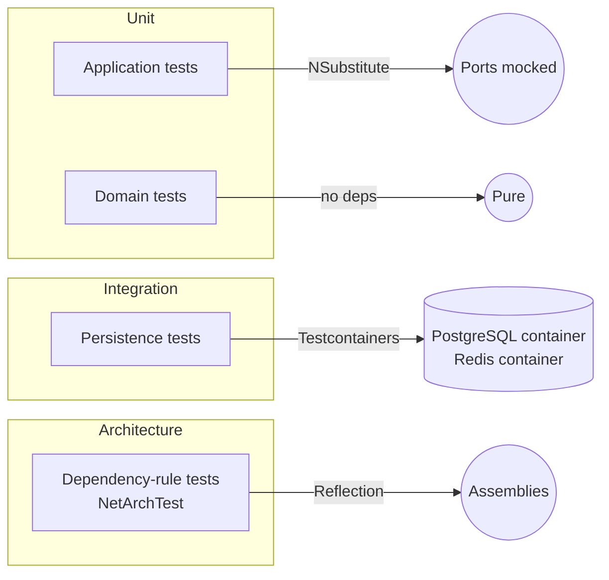

# Testing

Three test projects split by purpose and isolation level.



## Toolchain

| Concern | Tool |
|---|---|
| Runner | xUnit |
| Mocking | NSubstitute |
| Assertions | Shouldly |
| Containers | Testcontainers (PostgreSQL, Redis) |
| Web host | `Microsoft.AspNetCore.Mvc.Testing.WebApplicationFactory` |
| Architecture rules | NetArchTest.Rules |

## Running tests

```bash
# all
dotnet test

# architecture only (fast, no Docker)
dotnet test --filter "Category=Architecture"

# unit only
dotnet test tests/Hex.Scaffold.Tests.Unit

# integration only (requires Docker Desktop / compatible)
dotnet test tests/Hex.Scaffold.Tests.Integration

# single test
dotnet test --filter "FullyQualifiedName~ClassName.MethodName"
```

Tests are tagged with `[Trait("Category", "...")]` so you can filter by tier. Categories in use: `Unit`, `Integration`, `Architecture`.

## Unit tests

[`tests/Hex.Scaffold.Tests.Unit`](../tests/Hex.Scaffold.Tests.Unit)

Two kinds:

1. **Domain** ([`Domain/AccountAggregateTests.cs`](../tests/Hex.Scaffold.Tests.Unit/Domain/AccountAggregateTests.cs)) — construct aggregates, call methods, assert state and registered events. Zero mocks, zero IO.
2. **Application** ([`Application/CreateAccountHandlerTests.cs`](../tests/Hex.Scaffold.Tests.Unit/Application/CreateAccountHandlerTests.cs)) — substitute repositories and Mediator with NSubstitute, exercise a handler, assert outputs and interactions.

Example:

```csharp
[Fact]
public void ApplyUpdate_OmittedFields_AreLeftAlone()
{
  var account = Account.Create(
    livemode: false, displayName: "Original",
    contactEmail: "x@example.com", contactPhone: null,
    appliedConfigurations: [AppliedConfiguration.Customer],
    configurationJson: null, identityJson: null,
    defaultsJson: null, metadataJson: null);
  account.ClearDomainEvents();

  account.ApplyUpdate(
    displayName: (true, "New"),
    contactEmail: (false, null),  // omitted — should not change
    contactPhone: (false, null),
    appliedConfigurations: (false, null),
    configurationJson: (false, null), identityJson: (false, null),
    defaultsJson: (false, null), metadataJson: (false, null));

  account.DisplayName.ShouldBe("New");
  account.ContactEmail.ShouldBe("x@example.com");
  account.DomainEvents.First().ShouldBeOfType<AccountUpdatedEvent>();
}
```

## Integration tests

[`tests/Hex.Scaffold.Tests.Integration`](../tests/Hex.Scaffold.Tests.Integration)

Driven by an `IntegrationTestFixture : IAsyncLifetime` with two Testcontainers images:

- `PostgreSqlContainer` — database `hex-scaffold-test`, user `postgres`.
- `RedisContainer` — default image.

The fixture spins up both containers, then starts a `WebApplicationFactory<Program>` with:

- `ASPNETCORE_ENVIRONMENT = "Testing"`
- In-memory configuration overriding connection strings to container endpoints.
- `Database:ApplyMigrationsOnStartup = false` (tests call `EnsureCreatedAsync` themselves — no migration history needed).

An xUnit `ICollectionFixture<IntegrationTestFixture>` shares the containers across tests in the `"IntegrationTests"` collection.

Example shape (an `AccountRepositoryTests` is the natural counterpart — the Sample-era `SampleRepositoryTests` was retired alongside the Sample aggregate; the Account replacement is a follow-up that needs a Docker-equipped environment to land):

```csharp
public async Task InitializeAsync()
{
  _scope = fixture.Factory!.Services.CreateScope();
  _dbContext = _scope.ServiceProvider.GetRequiredService<AppDbContext>();
  _repository = _scope.ServiceProvider.GetRequiredService<IRepository<Account>>();
  await _dbContext.Database.EnsureCreatedAsync();
}
```

> **Docker is required.** Start Docker Desktop (or a compatible runtime like colima / Rancher Desktop) before running the integration suite. Mongo and Kafka are not provisioned by default; add them when you need end-to-end event coverage.

## Architecture tests

[`tests/Hex.Scaffold.Tests.Architecture/HexagonalDependencyTests.cs`](../tests/Hex.Scaffold.Tests.Architecture/HexagonalDependencyTests.cs)

Uses **NetArchTest** to enforce the dependency rules at build time. Every rule is a `[Fact]`:

| Test | Assertion |
|---|---|
| `Domain_ShouldNotDependOn_Application` | Domain has no Application references |
| `Domain_ShouldNotDependOn_AnyAdapter` | Domain has no Adapter/Api references |
| `Application_ShouldNotDependOn_AnyAdapter` | Application has no Adapter/Api references |
| `AdaptersInbound_ShouldNotDependOn_OutboundOrPersistence` | Inbound is isolated from other adapters |
| `AdaptersOutbound_ShouldNotDependOn_ApplicationOrInbound` | Outbound depends only on Domain |
| `AdaptersPersistence_ShouldNotDependOn_InboundOrOutbound` | Persistence depends on Domain (+ Application for query services) |
| `DomainEntities_ShouldHaveOnlyPrivateSetters` | `Account` has no public setters on its declared properties |

**These must pass for any PR.** They are cheap to run (no I/O) and catch drift immediately.

## When to add tests

| Change | Add |
|---|---|
| New aggregate / domain method | Unit test (Domain) |
| New use case handler | Unit test (Application) + integration test if it touches new infra |
| New adapter | Integration test with Testcontainers |
| New port / layer boundary | Update `HexagonalDependencyTests` |
| New value-object rule | Unit test asserting `ValueObjectValidationException` on invalid inputs |

## Coverage

`coverlet.collector` is referenced. Collect with `dotnet test --collect:"XPlat Code Coverage"`.
